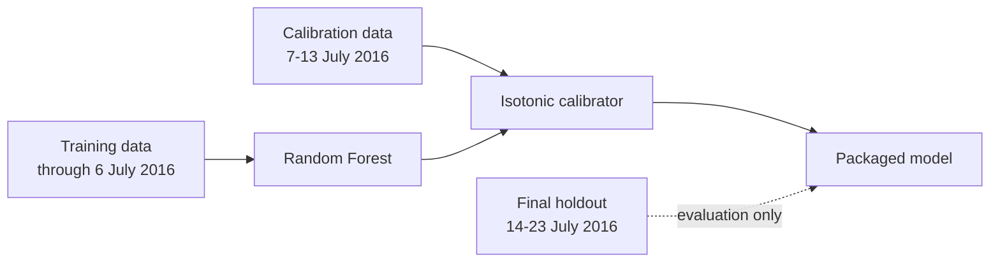

# Model card — telecom five-day delinquency risk model

This model estimates the probability that a telecom-enabled microcredit transaction will remain unpaid after five days. The intended use is fairly narrow: it supports risk prioritisation and follow-up. It does not make an approval or decline decision, and nothing in the current implementation turns the probability into an automated lending outcome.

The packaged Module 4 model is a 12-feature Random Forest with isotonic calibration. That specification was retained after a fairly extensive comparison process, including simpler alternatives that performed surprisingly well. The main reason for keeping the 12-feature version is not that it wins every comparison; it does not. Rather, it gives the most defensible overall balance on the later holdout while preserving a clear audit trail from development through packaging.

## Model identity

| Item | Value |
|---|---|
| Model name | `telecom_delinquency_random_forest_isotonic` |
| Artefact version | `1.0.0` |
| Model family | Random Forest |
| Calibration | Isotonic regression |
| Feature count | 12 |
| Random seed | 42 |
| Binary artefact | `models/selected_random_forest_isotonic.joblib` — local only |
| Metadata | `models/selected_model_metadata.json` |
| Artefact SHA-256 | `b70912867f0838f1e020a973ba5aa3f69e601a1dfce681dbe7d8b84e934dab9e` |

The hash is there for a simple reason: the binary itself is not stored in GitHub. The SHA-256 value lets us confirm that the metadata still refers to the exact local artefact that was packaged and tested.

## How the final artefact was fitted

The chronology matters because the dataset is short and the model is sensitive to time.

The Random Forest was fitted on **101,241 rows** through 6 July 2016. Isotonic calibration used a later **20,878-row** window from 7-13 July. The final 14-23 July holdout remained outside fitting and calibration.

The labelled modelling population itself ends on 23 July. The later records show an unexplained all-success outcome pattern, so those labels are not treated as supervised ground truth. The later feature values were still useful for drift and scenario analysis.

## What the model expects

The artefact stores the feature order explicitly. The 12 required predictors are:

- `cnt_ma_rech90`
- `daily_decr30`
- `last_rech_date_ma`
- `sumamnt_ma_rech90`
- `aon`
- `last_rech_amt_ma`
- `daily_decr90`
- `sumamnt_ma_rech30`
- `medianamnt_ma_rech30`
- `medianmarechprebal90`
- `rental30`
- `cnt_ma_rech30`

Missing numerical values are handled by the fitted median imputer contained in the package. If one of the required feature columns is absent, the inference script stops rather than silently scoring an incomplete record.

The output is equally restrained: raw Random Forest probability, calibrated probability, model name, and artefact version. There is no threshold-based credit decision in the inference layer.

## What happened on the final holdout

The selected calibrated model achieved the following on 14-23 July:

| Metric | Result |
|---|---:|
| ROC-AUC | **0.8287** |
| Average precision | **0.5667** |
| Brier score | **0.1230** |
| ECE, 10 bins | **0.0293** |
| Top-20% delinquency capture | **54.04%** |
| Observed delinquency rate | 20.78% |
| Mean calibrated predicted risk | 17.85% |

The ranking performance remains useful, and calibration is much more realistic than in the uncalibrated model. The difficult part is temporal stability: the holdout ROC-AUC is lower than development performance by more than the threshold we set before opening the holdout. That limitation stays visible throughout the project and is one reason the model is not presented as production-ready.

## What the model seems to be learning

The SHAP analysis gave a fairly coherent picture. Recharge behaviour dominates the fitted model, with `cnt_ma_rech90`, `sumamnt_ma_rech90`, `sumamnt_ma_rech30`, `cnt_ma_rech30`, and `daily_decr30` among the strongest global signals.

The same pattern appeared in local explanations. Stronger recharge behaviour often pulled lower-risk cases downward, while `rental30` and some recharge-amount patterns pushed higher-risk cases upward.

This helps with interpretability, but it does not turn association into causation. SHAP tells us how the fitted model uses a feature, not what would happen to repayment behaviour if that feature were changed.

## Why we did not simply keep simplifying

The later feature experiments were useful because they showed that the 12-feature specification contains more complexity than is strictly necessary for useful ranking.

A seven-feature recharge-only model remained competitive. Adding back only `daily_decr30` produced an eight-feature challenger that was slightly stronger than the 12-feature model on several development measures. The picture reversed on the already-opened holdout, where the 12-feature model was modestly better across all reported metrics.

That left us with a genuine trade-off rather than a clean winner. The eight-feature model is simpler and less dependent on several temporally unstable or redundant variables. The 12-feature model keeps a small advantage on the later holdout. For the assignment, the latter remains the formal model, while the eight-feature version stays documented as a serious challenger for future validation.

## Fairness, and what we cannot claim

The dataset does not contain attributes that directly identify protected demographic groups or other clearly defensible fairness groups. We therefore did not manufacture substitute groups simply to produce fairness metrics.

The consequence is straightforward: this project cannot demonstrate demographic fairness from the available data. It can only document that direct protected-group testing was not supported and that indirect proxy effects remain possible.

Operational slices such as account tenure or recharge activity were examined for robustness, but they are not treated as fairness groups.

## Stability is the main unresolved issue

The short observation period is the model's largest constraint.

Several variables show strong movement across time or by calendar position. The final holdout is also compositionally different from development, and the post-23 July block has an unexplained outcome regime. Those facts make it difficult to separate genuine behavioural change from artefacts of the extract.

The reduced-feature experiments were partly an attempt to probe this problem. They showed that a compact recharge-based core retains much of the useful signal, which is reassuring. At the same time, some of the additional features still improve precision or probability quality in certain periods. Their value is uneven rather than absent.

The synthetic post-23 July outcomes were used only to explore scenarios. They never entered official training, validation, calibration, or reported model performance.

## Robustness outside the headline metrics

Across account-tenure quartiles, the model remained useful, although performance improved with longer tenure. When the population was split into narrow recharge-activity bands, discrimination was weaker. That makes sense because recharge behaviour itself is one of the model's strongest sources of separation.

Small controlled perturbations usually did not move calibrated risk very much. Recharge-amount variables were the main exception for a minority of observations, where crossing a tree threshold could create a larger change.

Taken together, these checks make the model easier to trust as an academic artefact, but they do not erase the temporal limitation.

## Packaging and inference

The packaged object contains the fitted imputer, Random Forest, isotonic calibrator, ordered feature list, chronology, model parameters, and version metadata.

Batch inference is implemented in:

`src/inference/predict_selected_model.py`

The inference contract has two unit tests, both passing. A real batch run also scored 10 rows from the model-ready dataset successfully. That run was a functional check of the persisted artefact, not a new performance test.

The binary remains local. GitHub stores the metadata and its SHA-256 fingerprint so the exact artefact can still be identified later.

## Where this model can and cannot be used

Reasonable uses include operational prioritisation, repayment-risk monitoring, comparison of score distributions, and demonstration of a governed predictive-modelling workflow.

The current evidence does not support using the model as the sole basis for automatic credit approval or refusal, long-term default prediction, demographic fairness claims, or causal conclusions about customer behaviour. A materially different population would also require fresh validation before relying on the model.

## What would need monitoring in a real deployment

A production version would need much more history than we have here. The monitoring focus should include feature drift, delinquency prevalence, ROC-AUC and average precision once outcomes mature, calibration error, Brier score, top-risk-band capture, missingness, out-of-range inputs, and movement in the overall score distribution.

The eight-feature challenger is worth keeping in that monitoring framework as well. Fresh data would tell us whether its simpler feature set is genuinely more stable or whether the 12-feature model's small holdout advantage persists.

## Current position

For this project, the 12-feature calibrated Random Forest is a defensible final academic model. It is packaged, traceable, explainable, and tested through the documented inference path. It is not presented as fully production-ready.

The evidence trail is split across a few files rather than repeated here in full:

- `docs/model-documentation/module4_experiment_record.md` — chronological experiment record;
- `docs/governance/model_decision_log.md` — compact decision trail;
- `models/selected_model_metadata.json` — packaged artefact metadata;
- `reports/` — privacy-safe aggregate tables and figures.

The private AI-use log is maintained separately from this public repository.
