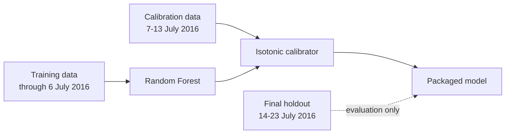

# Model card — telecom five-day delinquency risk model

## What this model is for

This model estimates the probability that a telecom-enabled microcredit transaction will not be repaid within five days. It is intended to support risk prioritisation and operational review. It is not designed to make an autonomous credit approval or decline decision.

The formal Module 4 model is a calibrated Random Forest using 12 behavioural and account-activity predictors. Its output is a calibrated delinquency probability, not a categorical lending decision.

## Model identity

| Item | Value |
|---|---|
| Model name | `telecom_delinquency_random_forest_isotonic` |
| Artefact version | `1.0.0` |
| Model family | Random Forest |
| Calibration | Isotonic regression |
| Feature count | 12 |
| Random seed | 42 |
| Binary artefact | `models/selected_random_forest_isotonic.joblib` — local only |
| Metadata | `models/selected_model_metadata.json` |
| Artefact SHA-256 | `b70912867f0838f1e020a973ba5aa3f69e601a1dfce681dbe7d8b84e934dab9e` |

The SHA-256 value is the integrity fingerprint for the exact packaged binary. If the binary is regenerated or otherwise changes, the fingerprint will change as well.

## Training and calibration chronology

The model is deliberately time-aware.

The packaged model was fitted on **101,241 training rows**. Isotonic calibration used **20,878 later rows** from 7-13 July. The final 14-23 July holdout was not used for fitting or calibration.

The broader labelled modelling population ends on 23 July 2016. Records after that date have an unexplained all-success outcome pattern and are not treated as valid supervised ground truth.

## Input contract

The model expects these 12 predictors in the order stored in the artefact:

- `cnt_ma_rech90`
- `daily_decr30`
- `last_rech_date_ma`
- `sumamnt_ma_rech90`
- `aon`
- `last_rech_amt_ma`
- `daily_decr90`
- `sumamnt_ma_rech30`
- `medianamnt_ma_rech30`
- `medianmarechprebal90`
- `rental30`
- `cnt_ma_rech30`

Missing numerical values are handled by the fitted median imputer contained in the packaged artefact.

The inference script rejects inputs that do not contain all required feature columns.

## Output contract

The batch inference layer returns:

- raw Random Forest delinquency probability;
- calibrated delinquency probability;
- model name;
- artefact version.

No threshold-based approval or decline decision is implemented.

## Final holdout performance

On the final 14-23 July holdout, the selected calibrated Random Forest achieved:

| Metric | Result |
|---|---:|
| ROC-AUC | **0.8287** |
| Average precision | **0.5667** |
| Brier score | **0.1230** |
| ECE, 10 bins | **0.0293** |
| Top-20% delinquency capture | **54.04%** |
| Observed delinquency rate | 20.78% |
| Mean calibrated predicted risk | 17.85% |

The model discriminates usefully on the holdout and the calibrated probabilities are materially better behaved than the uncalibrated scores. The holdout nevertheless shows temporal degradation relative to development results, so this should not be read as evidence of production stability over longer periods.

## What appears to drive the model

Global SHAP analysis shows that recharge behaviour dominates the fitted model. The strongest features include:

- `cnt_ma_rech90`;
- `sumamnt_ma_rech90`;
- `sumamnt_ma_rech30`;
- `cnt_ma_rech30`;
- `daily_decr30`.

Representative local explanations showed the same pattern: recharge frequency and recharge amount often push lower-risk cases downward, while `rental30` and recharge-amount patterns can push higher-risk cases upward.

SHAP is used here to explain model behaviour, not causation. A feature contribution shows how the fitted model reached a prediction; it does not prove that changing that feature would change repayment behaviour.

## Why the 12-feature model is still the formal model

Later sensitivity work produced a strong 8-feature challenger consisting of the seven-feature recharge core plus `daily_decr30`.

That challenger was slightly stronger on several development metrics, including mean ROC-AUC and top-20% capture. On the already-opened final holdout, however, the 12-feature model was modestly better across ROC-AUC, average precision, Brier score, ECE, and capture.

The 12-feature model therefore remains the formal Module 4 selection. The 8-feature model is documented as a credible lower-temporal-dependence challenger that should be tested again on a genuinely fresh validation window before any model switch.

## Fairness and representation limits

The modelling dataset does not contain attributes that directly identify protected demographic groups or other clearly defensible fairness groups. Demographic group-fairness metrics are therefore not supported by the available data, and no substitute protected groups were manufactured.

This means the model cannot be described as demographically fair on the basis of the current dataset. Indirect proxy effects also cannot be ruled out solely from feature names or SHAP explanations.

Operational robustness was assessed separately using tenure and recharge-activity segments. Those segments are business slices, not fairness groups.

## Temporal stability and data limitations

The largest limitation is the short observation window.

Several variables show pronounced temporal or calendar-position behaviour. The final holdout also differs from earlier development periods, and performance falls relative to development folds. The project therefore treats temporal stability as an open issue rather than a solved one.

The later post-23 July records remain useful for feature-drift and scenario analysis, but their outcome labels are not trusted as supervised ground truth.

Synthetic outcomes generated for that later period are explicitly scenario-only. They are not part of official training, validation, calibration, or performance evidence.

## Operational robustness

The selected model remains useful across account-tenure quartiles, although performance improves with longer tenure. Within narrow recharge-activity bands, ROC-AUC is lower. This is consistent with recharge behaviour itself being one of the model's main sources of separation.

Controlled perturbation testing showed that modest feature changes usually do not materially change calibrated risk. Recharge-amount variables can create larger movements for a minority of observations.

## Packaging and inference

The selected model is packaged with:

- the fitted median imputer;
- the fitted Random Forest;
- the fitted isotonic calibrator;
- the ordered feature contract;
- model parameters and chronology;
- artefact version metadata.

Batch inference is implemented in:

`src/inference/predict_selected_model.py`

Two unit tests cover the basic inference contract, and a real batch test successfully scored 10 rows from the model-ready dataset. That run is treated as a functional integration check rather than new model-performance evidence.

The local binary is intentionally excluded from GitHub. The committed metadata file identifies the expected artefact and its SHA-256 fingerprint.

## Intended use

Appropriate uses include:

- ranking cases for operational review;
- supporting repayment-risk monitoring;
- comparing risk distributions across operational populations;
- academic demonstration of a governed predictive-modelling workflow.

The model should not be used as the sole basis for:

- automatic credit approval or refusal;
- long-term default prediction;
- demographic fairness claims;
- causal interpretation of customer behaviour;
- deployment into a materially different population without fresh validation.

## Monitoring expectations

A production implementation would need monitoring beyond what can be demonstrated with this dataset. At minimum, the following should be tracked over time:

- input-feature drift;
- delinquency prevalence;
- ROC-AUC and average precision once outcomes mature;
- Brier score and calibration error;
- top-risk-band capture;
- missingness and out-of-range inputs;
- material changes in score distribution;
- performance of the 12-feature model relative to the 8-feature challenger on fresh data.

A new validation period is particularly important because the existing history is too short to establish long-term stability.

## Governance position

The model is suitable as the final academic model for this project, with clearly documented limitations. It should not be described as fully production-ready.

The main evidence trail is maintained in:

- `docs/model-documentation/module4_experiment_record.md`;
- `docs/governance/model_decision_log.md`;
- `models/selected_model_metadata.json`;
- privacy-safe aggregate tables and figures under `reports/`.

The private AI-use log is maintained separately and is not stored in this public repository.
