# Module 4 experiment record

This document is the running record of Module 4 modelling experiments, outputs, interpretation, and decisions. Raw machine-readable outputs remain under `reports/tables/`; supporting figures are stored under `reports/figures/module4/`.

## 0. Agreed modelling and validation position

### Business use

The model predicts five-day delinquency risk to support prioritisation and follow-up by credit-risk and repayment teams. It is intended as decision support rather than as an autonomous decision-maker.

### Primary modelling population

- Labelled modelling period: **1 June-23 July 2016**
- Development period: **1 June-13 July 2016**
- Final untouched holdout: **14-23 July 2016**
- Post-23 July period: retained only for exploratory robustness, distribution, and score-behaviour checks; not used for supervised performance evaluation

### Acceptance and selection criteria

| Area | Working criterion |
|---|---|
| Discrimination | Final holdout ROC-AUC >= 0.80 |
| Operational capture | Top 20% of predicted-risk observations capture >= 50% of actual delinquencies |
| Temporal stability | Holdout ROC-AUC should not fall by more than 0.03 from development/CV performance |
| Calibration | Brier score should improve on a prevalence-only probability baseline, supported by calibration review |
| Complexity vs value | Prefer the simpler and more interpretable model where business-relevant performance is materially similar |
| Explainability | Selected model must support global and local explanation |
| Sensitivity | Reasonable input changes should not cause implausibly unstable predictions |
| Fairness | The dataset does not contain attributes that directly identify protected demographic groups or other clearly defensible fairness groups. During modelling, available variables are reviewed for direct or indirect traits that should be treated as protected; any such data will be handled in line with fairness principles. |

Calendar-position variables may be explored, but the short observation period does not support treating an apparent day-of-month pattern as a stable seasonal effect.

Customer-history variables `prior_tx_count` and `is_repeat_customer` are excluded from the primary Module 4 specification. They remain sensitivity variables because their incremental predictive value was negligible in Module 3, their interpretation is affected by the limited observation window, and most final-holdout observations belong to customers not previously observed in development.

---

## 1. Frozen chronological split validation

**Script:** `src/models/validate_module4_split.py`

**Purpose:** Verify the frozen population, chronological split, post-cutoff regime, and customer continuity before model comparison.

### Output

| Population | Purpose | Dates | Rows | Delinquent rows | Delinquency rate |
|---|---|---|---:|---:|---:|
| Development | Training + time-aware CV | 2016-06-01 to 2016-07-13 | 122,119 | 20,209 | 16.55% |
| Final holdout | Untouched final evaluation | 2016-07-14 to 2016-07-23 | 28,648 | 5,953 | 20.78% |
| Post-23 July | Exploratory robustness/distribution checks only | 2016-07-24 to 2016-08-21 | 58,825 | 0 | 0.00% |

Customer continuity in the final holdout:

- seen-customer rows: **3,437**
- unseen-customer rows: **25,211**
- unseen-customer share: **88.00%**

### Interpretation

The final holdout has a materially higher delinquency rate than development and is compositionally different. It is therefore a meaningful short-term temporal generalisation test rather than a random sample of the development population.

The very high unseen-customer share strengthens the case for relying on behaviour/account features that are available to both new and returning customers. It also reinforces the decision not to rely on customer-history variables in the primary specification.

### Decision

**Accepted.** Freeze the chronological split and keep the post-23 July block outside supervised performance evaluation.

**Machine-readable output:** `reports/tables/module4_split_summary.json`

---

## 2. Feature and leakage review

**Script:** `src/models/review_module4_features.py`

**Purpose:** Confirm that the 12-feature working specification is suitable for Module 4 model development before fitting new models.

### Output

- rows reviewed: **150,767**
- candidate predictors: **12**
- `pdate` used as predictor: **False**
- identifier present in model-ready data: **False**
- source label present in model-ready data: **False**
- near-deterministic target flags: **None**
- exact duplicate feature pairs: **None**
- direct fairness-name flags: **None**
- maximum predictor missingness: **2.02%**
- status: **Pass**

### Interpretation

The primary feature set passed the structural leakage screen. No identifier, source target, temporal control, duplicate predictor, or suspicious near-deterministic target relationship was found. Missingness is low enough to be handled inside leakage-safe model pipelines.

The fairness-name check is only a safeguard. It does not establish whether a variable is or is not an indirect proxy; that question remains part of later modelling and interpretation.

### Decision

**Accepted.** Proceed to model benchmarking with the 12-feature primary specification.

**Machine-readable outputs:**
- `reports/tables/module4_feature_leakage_review.csv`
- `reports/tables/module4_feature_leakage_review.json`

---

## 3. Initial candidate-model benchmark

**Script:** `src/models/benchmark_module4_models.py`

**Purpose:** Compare a transparent baseline with two nonlinear challengers using development data only. The final holdout remained unopened.

### Models

- Logistic regression — interpretable baseline
- Random forest — nonlinear ensemble with moderate complexity
- XGBoost — stronger nonlinear challenger already supported by Module 3 evidence

### Development-period result

| Model | Mean ROC-AUC | Minimum ROC-AUC | Mean average precision | Mean Brier | Mean top-20% capture | Minimum top-20% capture |
|---|---:|---:|---:|---:|---:|---:|
| Random forest | **0.8688** | 0.8413 | **0.6292** | **0.1024** | **66.12%** | 58.18% |
| XGBoost | 0.8662 | 0.8329 | 0.6246 | 0.1065 | 65.00% | **58.78%** |
| Logistic regression | 0.8017 | 0.7055 | 0.5171 | 0.1270 | 60.20% | 51.74% |

### Interpretation

Both nonlinear models materially outperform logistic regression on discrimination, ranking, and calibration-related error. Logistic regression remains useful as the transparent baseline, but its weakest fold is substantially less stable.

Random forest is marginally strongest overall at this stage, while XGBoost remains close enough to justify further tuning.

### Decision

**Keep all three for comparison, tune Random Forest and XGBoost only.** Logistic regression remains the reference baseline rather than a tuning priority.

**Machine-readable outputs:**
- `reports/tables/module4_candidate_model_fold_metrics.csv`
- `reports/tables/module4_candidate_model_summary.csv`
- `reports/tables/module4_candidate_model_summary.json`

**MLflow experiment:** `module4_candidate_model_benchmark`

---

## 4. Chronological hyperparameter tuning

**Script:** `src/models/tune_module4_models.py`

**Purpose:** Test whether modest tuning improves the two nonlinear challengers without opening the final holdout or conducting an unnecessarily large parameter search.

### Best configuration by model

| Model | Configuration | Mean ROC-AUC | Minimum ROC-AUC | Mean AP | Mean Brier | Mean top-20% capture | Minimum top-20% capture |
|---|---|---:|---:|---:|---:|---:|---:|
| Random forest | max_depth=8, min_samples_leaf=20, max_features=sqrt | **0.8711** | 0.8417 | **0.6316** | **0.1012** | **66.41%** | 58.31% |
| XGBoost | max_depth=5, learning_rate=0.05, min_child_weight=5 | 0.8688 | 0.8417 | 0.6287 | 0.1062 | 64.96% | 58.12% |

### Interpretation

Tuning produces only modest gains, which is a useful result in itself: the earlier benchmark was already reasonably specified. Random forest remains the strongest overall development-period model and its ranking is reinforced rather than overturned by tuning.

The tuned Random Forest improves mean ROC-AUC from 0.8688 to 0.8711 and mean top-20% capture from 66.12% to 66.41%, while also slightly improving Brier score.

### Decision

**Freeze three candidates for final evaluation:**
- logistic regression baseline;
- tuned random forest;
- tuned XGBoost.

No further tuning is performed before the untouched holdout is opened.

**Machine-readable outputs:**
- `reports/tables/module4_tuning_fold_metrics.csv`
- `reports/tables/module4_tuning_summary.csv`
- `reports/tables/module4_tuning_summary.json`

**MLflow experiment:** `module4_model_tuning`

---

## 5. Final holdout evaluation

**Script:** `src/models/evaluate_module4_holdout.py`

**Status:** **Completed**

The final holdout was used for evaluation only. No tuning was performed on holdout results.

### Output

| Model | ROC-AUC | Average precision | Brier | Prevalence-baseline Brier | Top-20% capture | Mean predicted risk | Observed delinquency rate | ROC-AUC drop vs development | Core acceptance |
|---|---:|---:|---:|---:|---:|---:|---:|---:|---|
| Logistic regression | 0.8016 | 0.4825 | 0.1808 | 0.1664 | 50.71% | 39.66% | 20.78% | 0.0002 | Fail |
| Random forest | 0.8308 | 0.5807 | **0.1490** | 0.1664 | 54.19% | 36.57% | 20.78% | 0.0403 | Fail |
| XGBoost | **0.8316** | **0.5822** | 0.1548 | 0.1664 | **55.05%** | 37.17% | 20.78% | 0.0371 | Fail |

### Interpretation

All three models retain useful ranking ability on the later holdout. The nonlinear models remain clearly stronger than logistic regression on ROC-AUC, average precision, and top-20% capture.

Neither tuned nonlinear model meets the pre-agreed temporal-stability threshold of a maximum 0.03 ROC-AUC drop from development performance. Random forest falls by about 0.040 and XGBoost by about 0.037. This indicates a modest but material reduction in discrimination on the later period.

Calibration is the more visible weakness. Both nonlinear models improve on the prevalence-only Brier baseline, but their mean predicted risks (about 36.6%-37.2%) substantially exceed the observed delinquency rate of 20.78%. Logistic regression is worse on this criterion: its Brier score is poorer than the prevalence-only baseline and its mean predicted risk is about 39.7%.

The holdout therefore does not support declaring any candidate fully accepted under the criteria set before evaluation. At the same time, the results do not show model failure in the broader sense: random forest and XGBoost still exceed the minimum discrimination and operational-capture thresholds. The main unresolved issues are temporal stability and probability calibration.

### Decision

**Do not select a final production candidate yet.**

The next modelling step is to assess a leakage-safe calibration strategy using development data only, freeze that calibration approach independently of the holdout results, and then evaluate the calibrated probabilities without additional parameter tuning. Model ranking remains secondary until calibration and stability are considered together.

**Machine-readable outputs:**
- `reports/tables/module4_final_holdout_metrics.csv`
- `reports/tables/module4_final_holdout_summary.json`

**MLflow experiment:** `module4_final_holdout_evaluation`

---

## Supporting visuals

The running record will use generated figures under `reports/figures/module4/`. Figures are reproducible from the machine-readable tables rather than manually edited.

Planned figures:
- development vs final-holdout delinquency rate;
- initial candidate-model ROC-AUC comparison;
- initial candidate-model top-20% capture comparison;
- tuned nonlinear-model comparison;
- final holdout ROC-AUC comparison;
- final holdout top-20% capture comparison.

---

## Running decision summary

| Stage | Decision |
|---|---|
| Validation design | Use chronological development/final-holdout structure; do not claim long-term temporal stability |
| Calendar effects | Explore cautiously; do not place day-of-month effects at the forefront |
| Post-23 July data | Use only for exploratory robustness/distribution analysis |
| Customer history | Exclude from primary specification; retain only for sensitivity analysis |
| Feature set | 12-feature primary specification passed leakage review |
| Baseline | Retain logistic regression for interpretability/reference |
| Challengers | Random forest and XGBoost |
| Development-period leader | Tuned random forest |
| Final holdout | Completed: nonlinear models retain useful ranking but fail the pre-agreed stability threshold |
| Calibration | Isotonic selected on development data and supported by holdout sensitivity analysis; probability quality improves materially with minimal ranking loss |
| Final model selection | Prefer tuned Random Forest + isotonic calibration; retain calibrated XGBoost as challenger |


---

## 6. Development-only calibration assessment

**Script:** `src/models/assess_module4_calibration.py`

**Status:** **Completed**

### Purpose

Assess whether probability calibration can be improved for the two tuned nonlinear challengers without using the 14–23 July final holdout for method selection.

The experiment compares:

- uncalibrated probabilities;
- Platt scaling;
- isotonic calibration.

For each development-period evaluation fold, the base model is trained on earlier observations, the calibrator is fitted only on the immediately preceding seven calendar days, and performance is measured on a later development block.

### Selection rule

Calibration method selection is based on development-only evidence:

1. mean Brier score;
2. mean expected calibration error;
3. mean absolute calibration-in-the-large gap.

ROC-AUC, average precision, and top-20% capture are monitored to ensure calibration does not materially damage ranking performance.

### Output

| Model | Method | Mean ROC-AUC | Minimum ROC-AUC | Mean AP | Mean Brier | Mean ECE | Mean abs. calibration gap | Mean top-20% capture |
|---|---|---:|---:|---:|---:|---:|---:|---:|
| Random forest | Isotonic | 0.8332 | 0.8226 | 0.5737 | **0.1005** | **0.0464** | 0.0384 | 61.83% |
| Random forest | Uncalibrated | **0.8340** | **0.8234** | **0.5873** | 0.1021 | 0.0481 | **0.0291** | **61.92%** |
| Random forest | Platt | 0.8340 | 0.8234 | 0.5873 | 0.1045 | 0.0533 | 0.0385 | 61.92% |
| XGBoost | Isotonic | 0.8414 | 0.8195 | 0.5744 | **0.1026** | 0.0588 | 0.0502 | **61.21%** |
| XGBoost | Platt | **0.8424** | **0.8199** | **0.5867** | 0.1042 | **0.0586** | **0.0487** | 61.06% |
| XGBoost | Uncalibrated | 0.8424 | 0.8199 | 0.5867 | 0.1065 | 0.0734 | 0.0535 | 61.06% |

### Interpretation

Under the pre-defined selection rule, isotonic calibration has the best mean Brier score for both nonlinear models. For random forest it also gives a small ECE improvement over the uncalibrated model, although the mean absolute calibration gap becomes slightly worse. For XGBoost, isotonic improves Brier score and ECE relative to the uncalibrated model, but Platt has a marginally lower ECE and calibration gap.

The calibration gains are therefore real but modest rather than decisive. Isotonic also slightly reduces ROC-AUC and average precision, which is consistent with the stepwise mapping creating probability ties. Top-20% capture is essentially preserved.

The random-forest result is particularly nuanced: the uncalibrated model already has the smallest mean absolute calibration gap, while isotonic wins on the primary Brier criterion and slightly on ECE. This means calibration is not uniformly better on every measure.

### Decision

**Freeze isotonic calibration as the development-selected calibration method for both nonlinear candidates**, because the selection rule specified mean Brier score as the primary criterion before the results were observed.

Do not reinterpret this as evidence that isotonic is universally superior. The development results show a trade-off: improved probability error on average, with small losses in ranking metrics and mixed effects on calibration-in-the-large.

Any application of isotonic calibration to the already-opened final holdout will be treated as **confirmatory/sensitivity evidence**, not as a second independent final validation.

**Machine-readable outputs:**
- `reports/tables/module4_calibration_fold_metrics.csv`
- `reports/tables/module4_calibration_summary.csv`
- `reports/tables/module4_calibration_summary.json`

**MLflow experiment:** `module4_development_calibration`


---

## 7. Calibrated holdout sensitivity analysis

**Script:** `src/models/confirm_module4_calibration_holdout.py`

**Status:** **Completed**

### Purpose

Apply the development-selected **isotonic calibration** method to the already-opened final holdout as confirmatory/sensitivity evidence.

Chronology is preserved:

- base model training: through **6 July 2016**;
- calibration window: **7-13 July 2016**;
- evaluation: **14-23 July 2016** final holdout.

The script compares uncalibrated and isotonic-calibrated probabilities from the **same base-model train/calibration split**. This isolates the effect of calibration as far as possible.

### Output

| Model | Method | ROC-AUC | Average precision | Brier | ECE (10 bins) | Top-20% capture | Mean predicted risk | Observed delinquency rate | Abs. calibration gap | Beats prevalence Brier |
|---|---|---:|---:|---:|---:|---:|---:|---:|---:|---|
| Random forest | Uncalibrated | 0.8291 | 0.5777 | 0.1424 | 0.1389 | 54.04% | 34.67% | 20.78% | 0.1389 | Yes |
| Random forest | Isotonic | 0.8287 | 0.5667 | **0.1230** | **0.0293** | 54.04% | 17.85% | 20.78% | **0.0293** | Yes |
| XGBoost | Uncalibrated | 0.8270 | 0.5752 | 0.1488 | 0.1463 | 54.58% | 35.41% | 20.78% | 0.1463 | Yes |
| XGBoost | Isotonic | 0.8271 | 0.5689 | **0.1234** | **0.0291** | 54.51% | 17.94% | 20.78% | **0.0284** | Yes |

### Interpretation

The sensitivity result supports the development-period calibration decision. Isotonic calibration materially improves probability quality for both nonlinear candidates on the already-opened holdout.

For random forest, Brier score improves from 0.1424 to 0.1230 and ECE falls from 0.1389 to 0.0293. Mean predicted risk moves from 34.67% to 17.85%, much closer to the observed 20.78% delinquency rate. Top-20% capture is unchanged at 54.04%, while ROC-AUC changes only marginally.

For XGBoost, Brier score improves from 0.1488 to 0.1234 and ECE falls from 0.1463 to 0.0291. Mean predicted risk moves from 35.41% to 17.94%, again much closer to the observed rate. Top-20% capture is essentially unchanged and ROC-AUC is effectively stable.

The calibrated probabilities slightly underpredict average risk, but the calibration gap is far smaller than before calibration. This is a material improvement in probability reliability without meaningful loss of ranking performance.

### Decision

**Retain isotonic calibration as the preferred probability-calibration approach for both nonlinear candidates.**

The result strengthens the case for calibration but does not create a new independent validation result. The original final-holdout assessment remains the formal independent holdout evaluation. These calibrated results are confirmatory/sensitivity evidence.

The remaining model-selection question is now primarily the trade-off between random forest and XGBoost. Their calibrated holdout performance is very close. Random forest has a slightly better Brier score; XGBoost has a marginally higher top-20% capture. Any final choice should therefore return to the agreed complexity-versus-value principle rather than rely on tiny metric differences.

**Machine-readable outputs:**
- `reports/tables/module4_calibrated_holdout_metrics.csv`
- `reports/tables/module4_calibrated_holdout_summary.json`

**MLflow experiment:** `module4_calibrated_holdout_sensitivity`


---

## 8. Final model selection

### Decision rule

Where competing models deliver materially similar business-relevant performance, prefer the simpler and more interpretable option unless the more complex model provides a meaningful gain that justifies additional implementation, maintenance, computational, and explanation burden.

### Evidence considered

After development-only tuning and isotonic calibration:

- Random forest and XGBoost show very similar discrimination and top-20% capture.
- Random forest has a slightly better calibrated-holdout Brier score (0.1230 vs 0.1234).
- XGBoost has a marginally higher top-20% capture (54.51% vs 54.04%).
- The differences are too small to justify choosing XGBoost on predictive performance alone.
- Random forest is operationally and conceptually simpler than gradient boosting and is easier to explain to non-technical stakeholders, while still supporting SHAP-based global and local explanation.

### Selection

**Primary Module 4 model: tuned Random Forest with isotonic calibration.**

Frozen base-model parameters:

- `n_estimators=300`
- `max_depth=8`
- `min_samples_leaf=20`
- `max_features="sqrt"`
- `class_weight="balanced_subsample"`
- `random_state=42`

Calibration:

- isotonic regression;
- fitted on a chronologically later calibration window than the base-model training data and earlier than the scored evaluation period.

### Challenger retained

**XGBoost with isotonic calibration** remains the documented challenger model. It is not rejected as ineffective; it is simply not preferred because its small metric advantage on one operational measure does not justify the additional model complexity.

### Validation caveat

The selected random forest still missed the pre-agreed independent-holdout temporal-stability criterion before calibration. Calibration materially improved probability quality but does not remove that stability finding, because calibration does not change the underlying ranking model in a way that restores the original independent holdout result.

The selected model should therefore be described as the **preferred candidate for this assignment**, not as a fully production-validated model. Longer historical coverage would be needed to establish stronger temporal stability.


---

## 9. Post-23 July feature-quality and score-behaviour analysis

**Script:** `src/models/analyze_post23_feature_quality.py`

**Status:** **Completed**

### Purpose

Assess whether the 24 July-21 August records contain predictor information that remains usable for exploratory robustness and scenario analysis, without treating their all-success outcome labels as valid ground truth.

The analysis compares the 12 selected predictors in the labelled modelling population with the post-23 July population using missingness, observed ranges, robust median shifts, Population Stability Index (PSI), and calibrated selected-model score distributions.

### Output

Six features show high distribution shift by the descriptive PSI bands:

- `daily_decr30` — PSI **3.578**
- `daily_decr90` — PSI **3.494**
- `rental30` — PSI **0.687**
- `sumamnt_ma_rech90` — PSI **0.504**
- `cnt_ma_rech90` — PSI **0.470**
- `last_rech_amt_ma` — PSI **0.337**

Two additional features show moderate shift:

- `medianamnt_ma_rech30` — PSI **0.249**
- `sumamnt_ma_rech30` — PSI **0.124**

The remaining four features fall in the low-shift band.

Missingness is generally stable or lower in the later period. Only `aon` changes by at least one percentage point. No selected feature has an out-of-labelled-range rate of 1% or more, so the later values mostly remain within previously observed numerical ranges even though their distributions have moved substantially.

### Selected-model score behaviour

| Population | Rows | Mean calibrated risk | Median | 75th percentile | 95th percentile |
|---|---:|---:|---:|---:|---:|
| Final holdout | 28,648 | 17.85% | 10.01% | 26.26% | 61.90% |
| Post-23 July | 58,825 | 14.20% | 7.90% | 18.49% | 47.06% |

The post-23 July population receives materially lower risk scores overall than the final holdout.

### Interpretation

The later records are **not feature-invalid**, but they are also **not simply more of the same population**. Their values mostly remain inside previously observed ranges and missingness is not problematic, yet several important predictors have shifted strongly.

This distinction matters. The post-23 July records remain useful for exploratory drift, robustness, and scenario analysis because their predictor data are structurally usable. However, generating synthetic repayment labels by merely copying the earlier delinquency rate would ignore the substantial change in the predictor distribution.

The lower calibrated score distribution suggests that, under the selected model, the later population looks lower-risk than the final holdout. Because the actual outcomes are not trustworthy, this cannot be interpreted as evidence that real delinquency actually fell.

### Decision on synthetic outcomes

**Proceed only as an explicitly synthetic scenario exercise, not as a repaired extension of the labelled dataset.**

Any synthetic outcomes should:

- preserve the actual post-23 July predictor values;
- derive synthetic delinquency probabilities conditionally from the observed features rather than applying a simple fixed overall delinquency rate;
- support multiple scenarios rather than one supposedly “correct” synthetic future;
- remain in a separate synthetic-data location;
- never be used to increase the official training population, re-estimate official performance, or claim observed repayment behaviour after 23 July.

Given the strong feature drift, scenario generation should explicitly acknowledge that it assumes some continuation of earlier feature-outcome relationships into a changed predictor population.

**Machine-readable outputs:**
- `reports/tables/module4_post23_feature_quality.csv`
- `reports/tables/module4_post23_score_distribution.csv`
- `reports/tables/module4_post23_feature_quality_summary.json`

**Figures:**
- `reports/figures/module4/post23_feature_psi.png`
- `reports/figures/module4/post23_score_distribution.png`


---

## 10. Synthetic post-23 July scenario dataset

**Script:** `src/models/generate_post23_synthetic_scenarios.py`

**Status:** **Completed**

### Purpose

Use the genuine post-23 July predictor values for clearly labelled scenario analysis without pretending that the missing/unreliable repayment outcomes are known.

### Scenario design

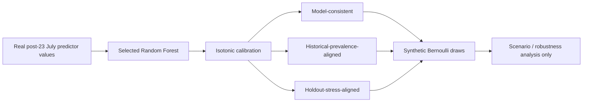
```mermaid
flowchart LR
    A[Real post-23 July predictor values] --> B[Selected Random Forest]
    B --> C[Isotonic calibration]
    C --> D[Model-consistent]
    C --> E[Historical-prevalence-aligned]
    C --> F[Holdout-stress-aligned]
    D --> G[Synthetic Bernoulli draws]
    E --> G
    F --> G
    G --> H[Scenario / robustness analysis only]
```

The three scenarios preserve the real feature values and differ only in the expected delinquency level.

### Output

| Scenario | Rows | Expected delinquency probability | Realised synthetic delinquency rate | Log-odds shift | Median probability | 95th percentile probability |
|---|---:|---:|---:|---:|---:|---:|
| Model-consistent | 58,825 | **14.20%** | 14.10% | 0.000 | 7.90% | 47.06% |
| Historical-prevalence-aligned | 58,825 | **17.35%** | 17.47% | 0.301 | 10.38% | 54.57% |
| Holdout-stress-aligned | 58,825 | **20.78%** | 20.70% | 0.588 | 13.38% | 61.55% |

A fixed random seed of 42 makes the realised synthetic outcomes reproducible.

### Visual summary

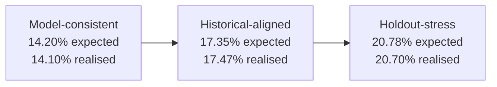
```mermaid
flowchart LR
    A["Model-consistent<br/>14.20% expected<br/>14.10% realised"] --> B["Historical-aligned<br/>17.35% expected<br/>17.47% realised"] --> C["Holdout-stress<br/>20.78% expected<br/>20.70% realised"]
```

The realised synthetic delinquency rates closely track the intended scenario means, which confirms that the sampling process behaves as designed.

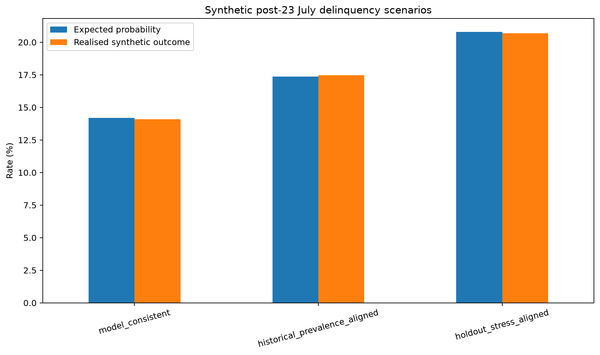

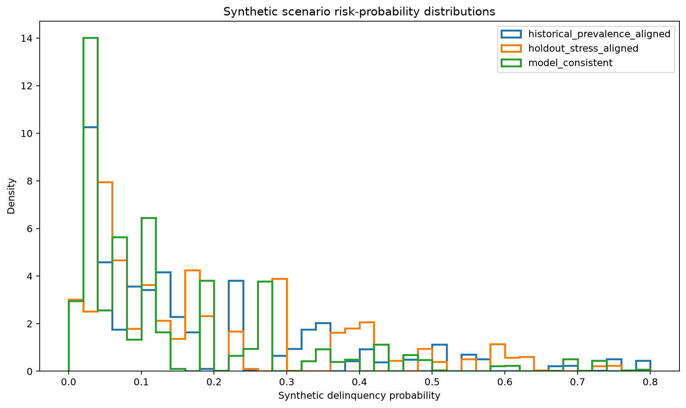

### Interpretation

The scenario dataset gives us three plausible *analytical futures* for exactly the same post-23 July customers and feature values.

The model-consistent scenario reflects what the selected calibrated model expects from the shifted later population. The historical-prevalence-aligned scenario asks what the same customers would look like if overall delinquency returned to the labelled-period average. The holdout-stress scenario asks what would happen if the later population experienced the higher delinquency level observed in the final holdout.

Because the adjustment is applied as a constant log-odds shift, the relative risk ordering of individual observations is preserved within each scenario. What changes is the population-level expected event rate.

This is useful for robustness and sensitivity work because it separates two questions:

- which customers appear relatively riskier based on their observed features;
- how the same risk ordering behaves under different plausible overall delinquency environments.

### Safeguards and interpretation limits

The synthetic dataset is **not** a repaired version of the original data and does not create observed repayment history after 23 July.

It must remain separate from the official modelling dataset and must not be used to:

- increase the official labelled training population;
- report synthetic-label performance as observed model performance;
- recalibrate or validate the model as though synthetic outcomes were ground truth;
- claim that any one scenario represents what actually happened after 23 July.

### Decision

**Retain the synthetic dataset for scenario, sensitivity, and demonstration analysis only.**

The three-scenario design is preferable to generating a single synthetic continuation because it makes the underlying assumptions visible rather than hiding them inside one fabricated outcome series.

**Outputs:**
- `data/synthetic/module4_post23_synthetic_scenarios.csv`
- `reports/tables/module4_synthetic_scenario_summary.csv`
- `reports/tables/module4_synthetic_scenario_summary.json`
- `reports/figures/module4/synthetic_scenario_rates.png`
- `reports/figures/module4/synthetic_scenario_probability_distributions.png`


---

## 11. SHAP explainability for the selected Random Forest

**Script:** `src/models/explain_module4_random_forest.py`

**Status:** **Completed**

### Purpose

Explain how the selected tuned Random Forest uses the 12 approved predictors, both globally and for individual observations.

### What SHAP explains

SHAP is applied to the **base Random Forest**. Isotonic calibration is a separate monotonic post-processing step, so the SHAP values explain the feature logic of the tree model itself. For local examples, both the raw Random Forest probability and the calibrated probability are reported.

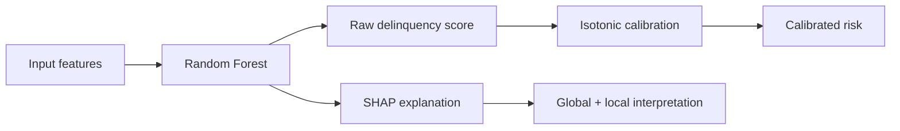
```mermaid
flowchart LR
    A[Input features] --> B[Random Forest]
    B --> C[Raw delinquency score]
    B --> D[SHAP explanation]
    C --> E[Isotonic calibration]
    E --> F[Calibrated risk]
    D --> G[Global + local interpretation]
```

### Global SHAP result

| Rank | Feature | Mean absolute SHAP | Mean SHAP |
|---:|---|---:|---:|
| 1 | `cnt_ma_rech90` | **0.0758** | -0.0547 |
| 2 | `sumamnt_ma_rech90` | **0.0603** | -0.0429 |
| 3 | `sumamnt_ma_rech30` | **0.0422** | -0.0201 |
| 4 | `cnt_ma_rech30` | **0.0376** | -0.0147 |
| 5 | `daily_decr30` | **0.0305** | -0.0195 |
| 6 | `rental30` | 0.0268 | 0.0193 |
| 7 | `last_rech_date_ma` | 0.0251 | 0.0034 |
| 8 | `daily_decr90` | 0.0214 | -0.0047 |
| 9 | `aon` | 0.0165 | -0.0033 |
| 10 | `medianmarechprebal90` | 0.0159 | -0.0082 |

The dominant global signal is **recharge behaviour**. Recharge frequency and recharge amount over 30- and 90-day windows occupy four of the top five positions. This is consistent with the broader modelling result that account/recharge behaviour carries more useful predictive information than customer-history status.

A negative mean SHAP value does **not** mean the feature is always protective. It means that, across the sampled holdout observations, the feature tended on average to push predictions downward relative to the model baseline. Direction for individual observations depends on the actual feature value and interactions.

### Visual summary

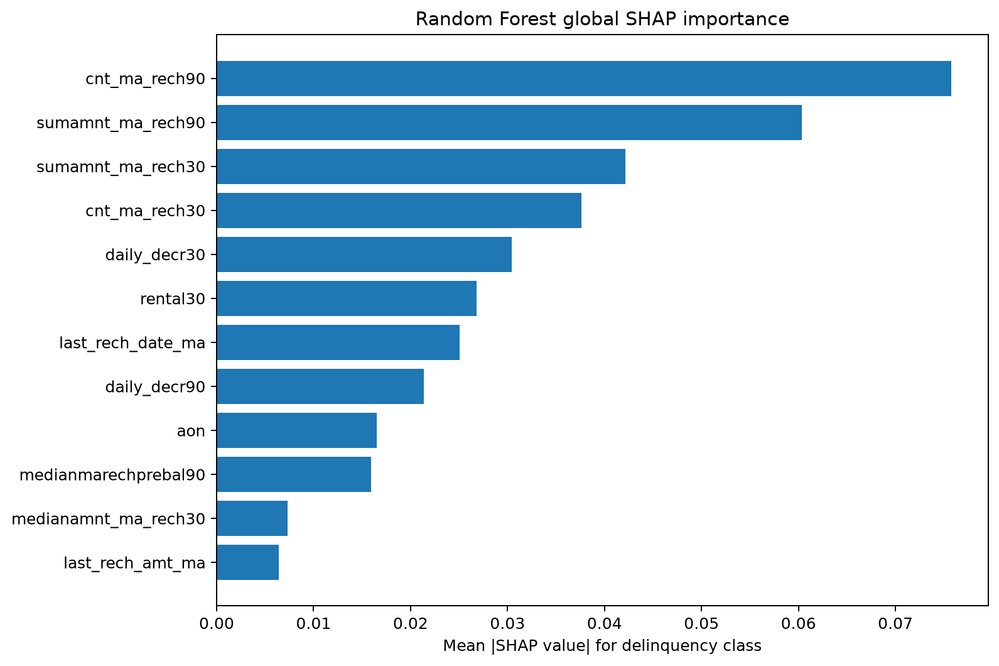

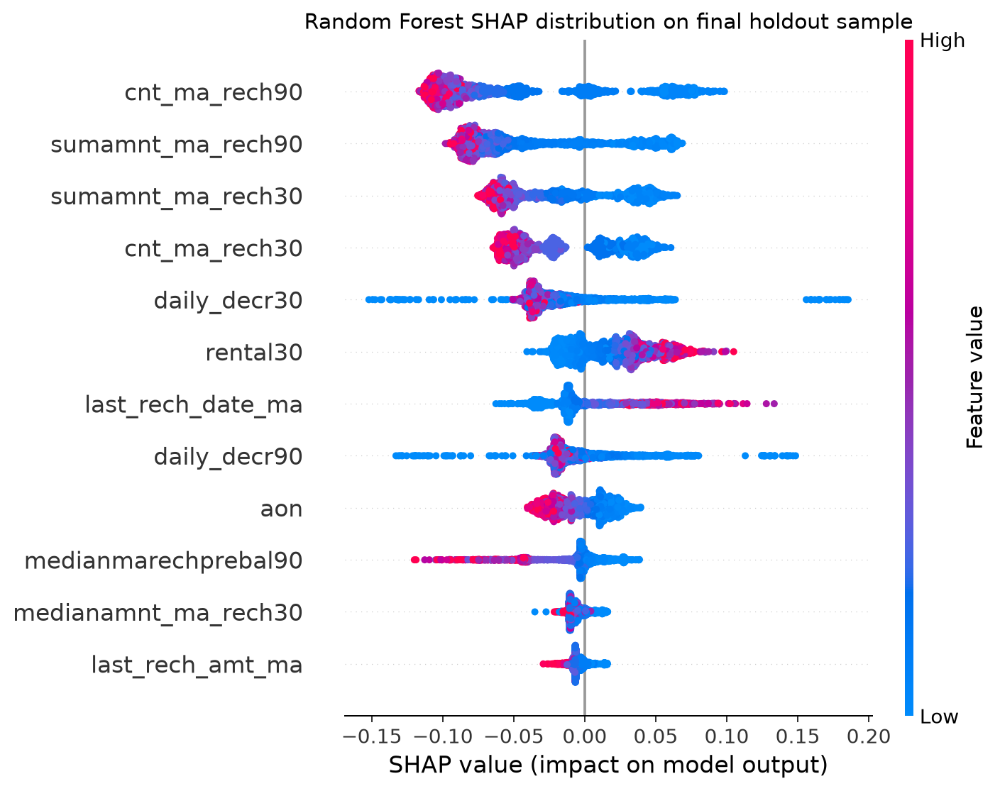

The bar chart answers **which features matter most overall**. The beeswarm adds direction and spread, showing whether high or low values tend to move individual predictions upward or downward.

### Representative local cases

| Case | Raw risk | Calibrated risk | Observed outcome | Main local message |
|---|---:|---:|---:|---|
| Low-risk | 10.87% | **2.17%** | Repaid | Higher recharge frequency and recharge amounts strongly push risk downward |
| Typical-risk | 26.91% | **10.01%** | Repaid | Recharge-frequency and recharge-amount variables still reduce risk materially |
| High-risk | 70.94% | **47.06%** | Delinquent | `rental30` and recharge-amount variables push the prediction strongly upward |

#### Low-risk case

Strongest contributors:

- `cnt_ma_rech90`: SHAP **-0.1069**
- `sumamnt_ma_rech90`: SHAP **-0.0797**
- `sumamnt_ma_rech30`: SHAP **-0.0621**

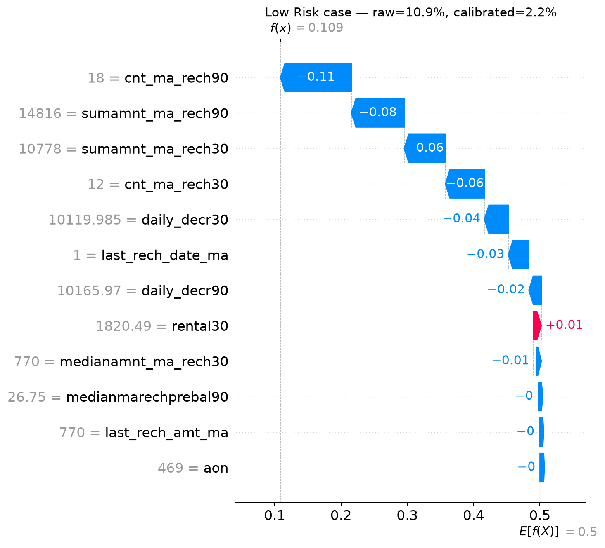

#### Typical-risk case

Strongest contributors:

- `cnt_ma_rech90`: SHAP **-0.0761**
- `sumamnt_ma_rech90`: SHAP **-0.0587**
- `medianmarechprebal90`: SHAP **-0.0349**

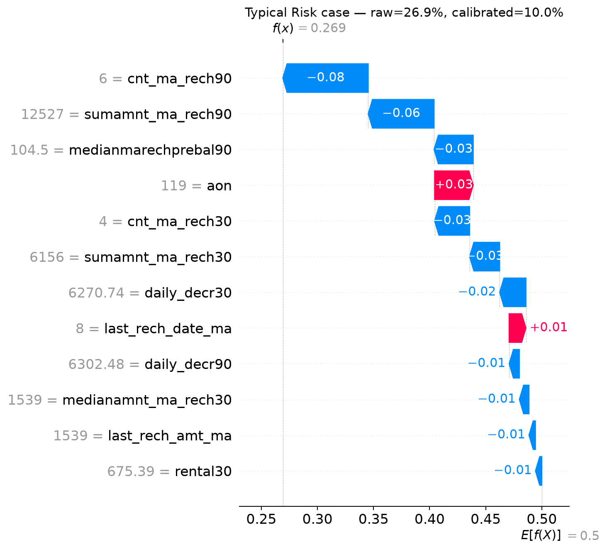

#### High-risk case

Strongest contributors:

- `rental30`: SHAP **+0.0661**
- `sumamnt_ma_rech90`: SHAP **+0.0468**
- `sumamnt_ma_rech30`: SHAP **+0.0427**

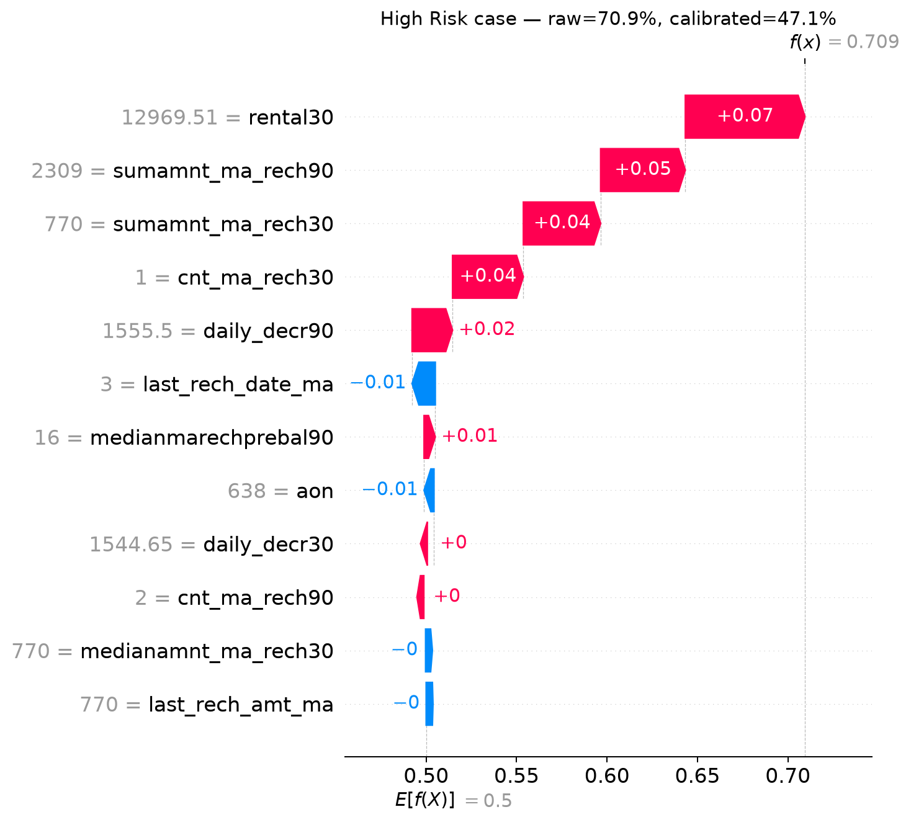

### Interpretation

The SHAP results support a coherent business story. The model primarily distinguishes repayment risk through patterns of **recharge frequency, recharge value, account activity, and rental/decrement behaviour**.

The local examples are also internally consistent:

- the low-risk observation is pushed down mainly by stronger recharge activity;
- the typical case still benefits from similar recharge-related signals but to a lesser extent;
- the high-risk observation is pushed upward by `rental30` and recharge-amount patterns.

Calibration then rescales these raw Random Forest probabilities substantially. For example, the low-risk case moves from 10.87% raw risk to 2.17% calibrated risk, while the high-risk case moves from 70.94% to 47.06%. SHAP explains why the Random Forest ranked these cases as it did; isotonic calibration separately makes the probability scale more realistic.

### Interpretation limits

SHAP describes **how the fitted model uses the data**. It does not prove causal effects.

For example, a positive SHAP contribution from `rental30` means that this variable increased the model's predicted delinquency risk for that observation. It does not mean that changing rental behaviour would necessarily change actual repayment behaviour.

Likewise, feature importance does not establish fairness or policy appropriateness. Important variables still need to be interpreted in context.


### Two pillars supporting confidence in the model

The evidence developed so far supports confidence in the preferred model through two distinct but complementary pillars.

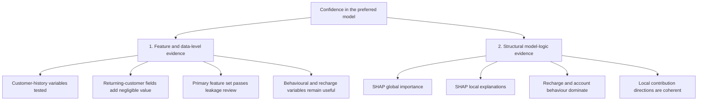
```mermaid
flowchart TD
    A[Confidence in the preferred model] --> B[1. Feature and data-level evidence]
    A --> C[2. Structural model-logic evidence]

    B --> B1[Customer-history variables tested]
    B --> B2[Returning-customer fields add negligible value]
    B --> B3[Primary feature set passes leakage review]
    B --> B4[Behavioural and recharge variables remain useful]

    C --> C1[SHAP global importance]
    C --> C2[SHAP local explanations]
    C --> C3[Recharge and account behaviour dominate]
    C --> C4[Local contribution directions are coherent]
```

#### Pillar 1 — Feature and data-level evidence

Earlier analysis assessed the variables themselves and, in particular, the customer-history fields. The evidence showed that `prior_tx_count` and `is_repeat_customer` add negligible predictive value, are affected by the limited observation window, and are less relevant in a final holdout where most observations belong to customers not previously seen in development.

The primary specification therefore relies instead on features that are available to both new and returning customers. The 12-feature set also passed the leakage and structural review: no identifier, source target, duplicate predictor, or near-deterministic target relationship was found.

This pillar gives confidence that the model is built on a defensible and operationally usable feature set rather than on fragile customer-history artefacts.

#### Pillar 2 — Structural model-logic evidence

The SHAP analysis adds a separate layer of confidence by assessing how the fitted Random Forest actually uses those variables.

The most influential features are dominated by recharge frequency, recharge amount, account activity, and related behavioural measures. These signals are also visible in representative local explanations: stronger recharge behaviour pushes some cases toward lower predicted delinquency risk, while other account and recharge patterns push high-risk cases upward.

This does not prove causation, but it shows that the model's internal logic is coherent with the behavioural assumptions underpinning the project. The model is not merely producing acceptable performance metrics; its decisions can also be traced back to a plausible pattern of feature use.

#### Combined interpretation

Together, the two pillars strengthen confidence in the model in different ways:

- **feature-level evidence** supports the appropriateness and robustness of the input specification;
- **structural explainability evidence** supports the internal coherence and interpretability of the fitted model logic.

This combined evidence increases confidence that the preferred Random Forest is learning meaningful behavioural relationships rather than relying on unstable customer-history fields or accidental artefacts.

It does **not** remove the temporal-stability limitation identified in the independent holdout. The model remains the preferred assignment candidate, but stronger production-readiness claims would still require validation over a longer historical period.


### Decision

**Retain SHAP as the primary explainability approach for the selected Random Forest.**

The global and local explanations are sufficiently coherent for use in the assignment, and they support the decision to prefer Random Forest over XGBoost when predictive performance is materially similar.

**Outputs:**
- `reports/tables/module4_shap_global_importance.csv`
- `reports/tables/module4_shap_local_cases.csv`
- `reports/tables/module4_shap_summary.json`
- `reports/figures/module4/shap_global_importance.png`
- `reports/figures/module4/shap_global_beeswarm.png`
- `reports/figures/module4/shap_local_low_risk.png`
- `reports/figures/module4/shap_local_typical_risk.png`
- `reports/figures/module4/shap_local_high_risk.png`


---

## 12. Fairness feasibility and operational robustness

**Script:** `src/models/assess_module4_fairness_robustness.py`

**Status:** **Completed**

The fairness part of this exercise is necessarily limited by the data. None of the modelling fields directly identify protected demographic groups, so there is no defensible basis for producing demographic group-fairness metrics. We deliberately did not manufacture substitute groups from unrelated variables just to fill that space. The remaining uncertainty is whether some behavioural variables could act as indirect proxies, which cannot be resolved from names or SHAP explanations alone.

The robustness results are more concrete.

Across account-tenure quartiles, the model remains useful throughout the holdout. ROC-AUC ranges from about **0.81 to 0.85**, and the strongest-tenure group also has the best top-20% capture. That suggests longer observed account history gives the model a cleaner behavioural signal, but the shortest-tenure group is still usable rather than collapsing.

Recharge-based slices look weaker, with ROC-AUC around **0.67-0.69**. I do not interpret that as simple model failure. Recharge activity is one of the model's strongest predictors, so once we divide the population into narrow recharge bands, much of the variation the model normally uses to separate risk has already been removed.

The perturbation test adds another perspective. Small input changes usually leave calibrated risk unchanged or nearly unchanged. The larger movements are concentrated mainly in recharge-amount variables. For `sumamnt_ma_rech90`, the 95th-percentile absolute change is about **5.6 percentage points**, but only about **1.15%** of sampled observations move by ten points or more.

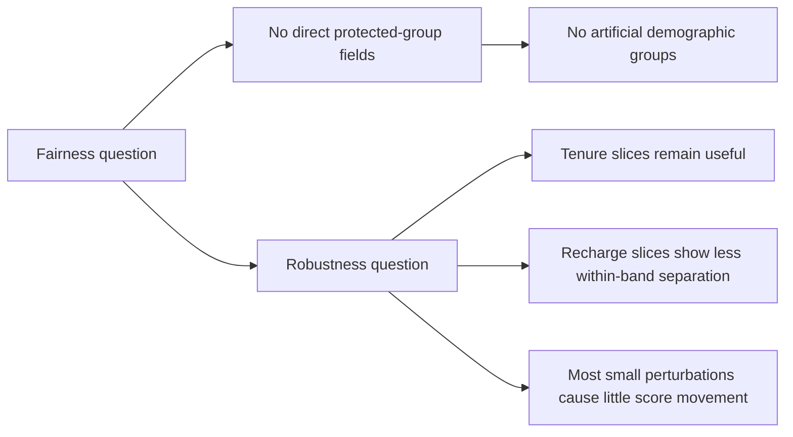
```mermaid
flowchart LR
    A[Fairness question] --> B[No direct protected-group fields]
    B --> C[No artificial demographic groups]
    A --> D[Robustness question]
    D --> E[Tenure slices remain useful]
    D --> F[Recharge slices show less within-band separation]
    D --> G[Most small perturbations cause little score movement]
```

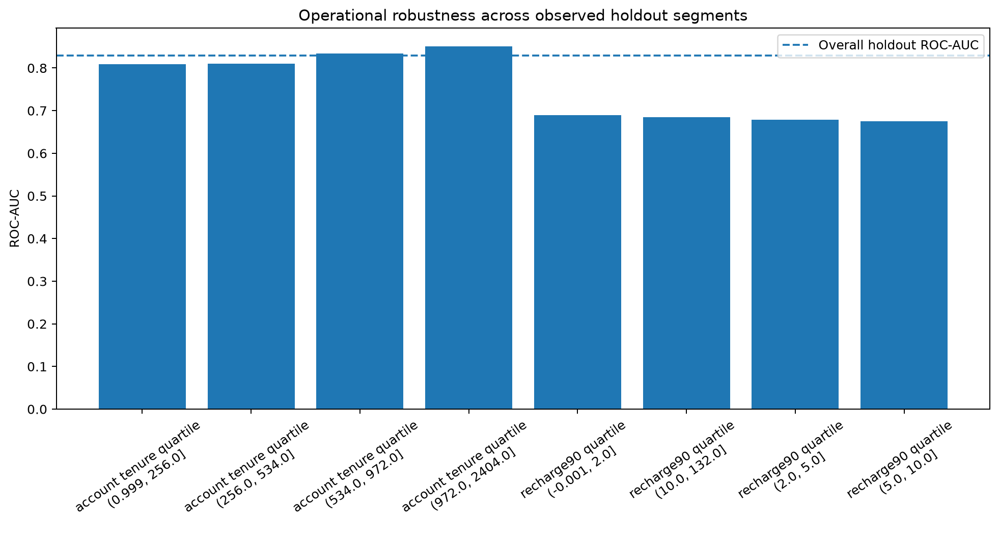

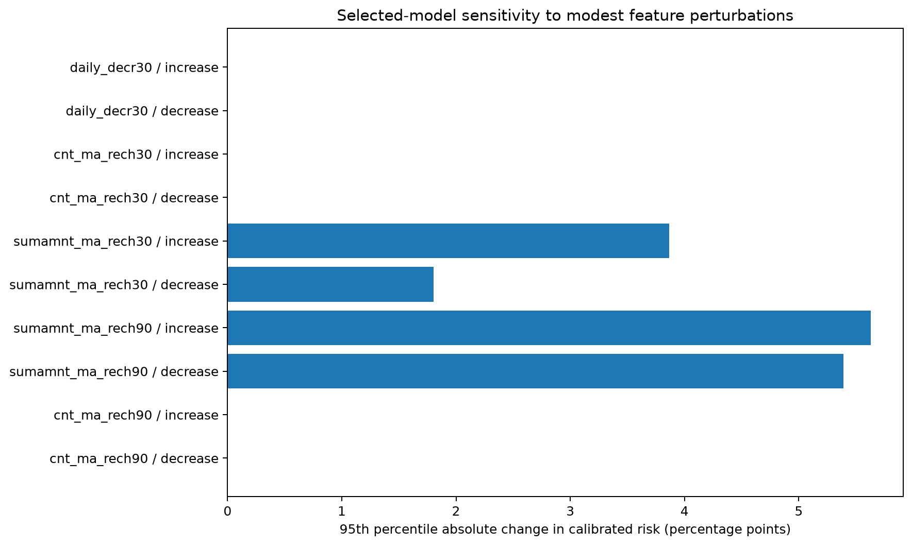

The conclusion is intentionally uneven. We cannot claim demographic fairness from these data, but we can say that the model is reasonably robust across operational tenure segments and is not generally hypersensitive to modest feature changes. The weaker recharge-slice results are consistent with recharge behaviour being central to the model's overall discrimination.

The temporal-stability limitation remains separate and unresolved.

**Outputs:**
- `reports/tables/module4_operational_robustness_segments.csv`
- `reports/tables/module4_feature_sensitivity.csv`
- `reports/tables/module4_fairness_robustness_summary.json`
- `reports/figures/module4/operational_segment_roc_auc.png`
- `reports/figures/module4/feature_sensitivity_p95.png`

---

## 13. Parallel test with less temporal dependence

**Script:** `src/models/compare_temporal_light_variants.py`

**Status:** **Completed**

Because the history covers only a short period, we wanted to know how much useful signal survives when the model is made less dependent on tenure, recency, and variables that had shown the strongest temporal movement.

The Random Forest settings and isotonic calibration stayed fixed. Only the feature set changed.

| Variant | Features | ROC-AUC | Average precision | Brier | ECE | Top-20% capture |
|---|---:|---:|---:|---:|---:|---:|
| Current model | 12 | **0.8287** | **0.5667** | 0.1230 | 0.0293 | 54.04% |
| Temporal-light | 10 | 0.8195 | 0.5609 | 0.1247 | 0.0323 | 53.74% |
| Drift-reduced | 7 | 0.8251 | 0.5545 | **0.1223** | **0.0256** | **55.69%** |

Removing `aon` and `last_rech_date_ma` costs a little performance, but the model remains useful. More surprisingly, the seven-feature drift-reduced version recovers most of the lost discrimination and actually improves top-20% capture, Brier score, and ECE on this holdout sensitivity check.

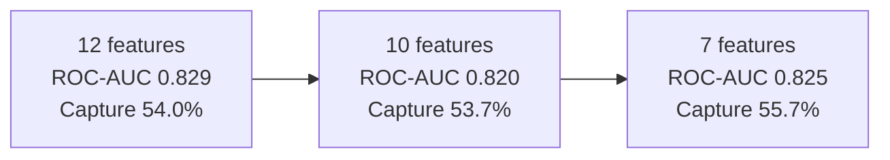
```mermaid
flowchart LR
    A[12 features<br/>ROC-AUC 0.829<br/>Capture 54.0%] --> B[10 features<br/>ROC-AUC 0.820<br/>Capture 53.7%]
    B --> C[7 features<br/>ROC-AUC 0.825<br/>Capture 55.7%]
```

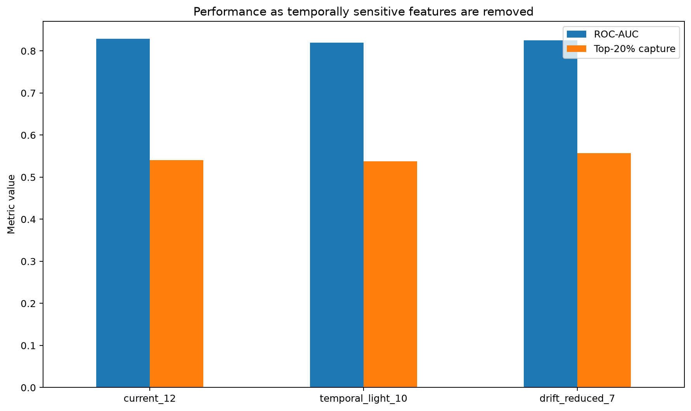

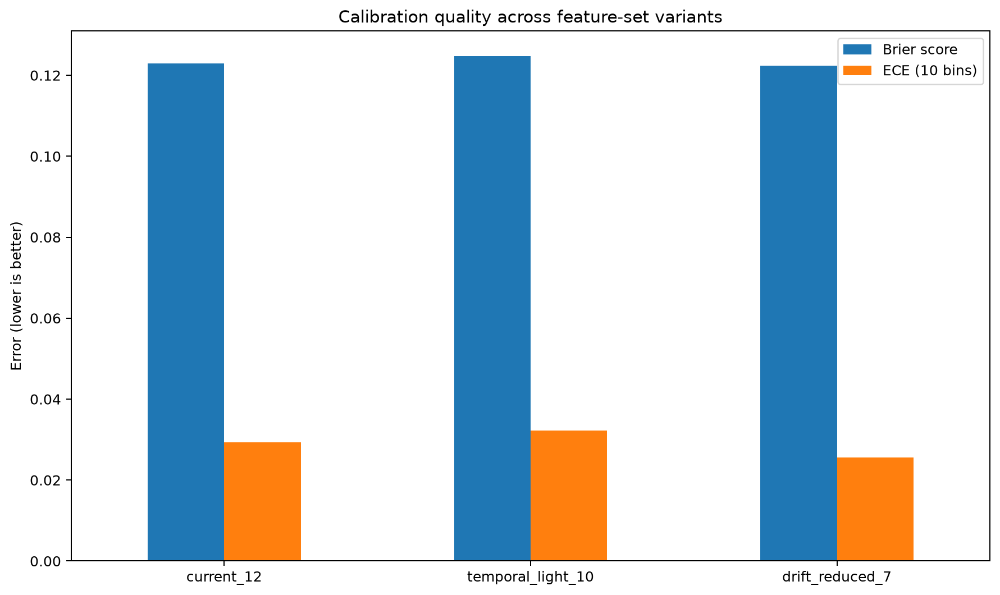

The seven remaining variables are all recharge-behaviour measures. That fits the SHAP result, which had already shown that recharge behaviour dominates the model's internal logic.

This comparison was designed after the holdout had already been opened, so it cannot serve as a fresh validation. What it does show is that the model's usefulness does not disappear when we strip away explicit tenure/recency fields and several strongly drifting activity variables. That made the seven-feature version worth testing again on earlier chronological folds.

**Outputs:**
- `reports/tables/module4_temporal_light_model_comparison.csv`
- `reports/tables/module4_temporal_light_model_comparison.json`
- `reports/figures/module4/temporal_light_model_performance.png`
- `reports/figures/module4/temporal_light_model_calibration.png`

---

## 14. Development-only check of the 12-feature and 7-feature models

**Script:** `src/models/compare_dev_12_vs_7.py`

**Status:** **Completed**

The seven-feature model remained competitive when the comparison was moved back into the development period, which reduces the chance that its good holdout result was simply a late-period accident.

| Variant | Mean ROC-AUC | Weakest-fold ROC-AUC | Mean average precision | Mean Brier | Mean ECE | Mean top-20% capture | Weakest-fold capture |
|---|---:|---:|---:|---:|---:|---:|---:|
| Current 12-feature model | 0.8332 | 0.8226 | **0.5737** | **0.1005** | 0.0464 | **61.83%** | 58.18% |
| Drift-reduced 7-feature model | **0.8384** | **0.8303** | 0.4994 | 0.1056 | **0.0350** | 60.96% | **59.34%** |

There is no neat winner. The seven-feature model is slightly stronger on mean and minimum ROC-AUC and has the better weakest-fold capture. The 12-feature model keeps a clear advantage in average precision and a somewhat better Brier score overall.

The average-precision gap comes mostly from late June, where the 12-feature model reaches **0.647** and the seven-feature version falls to **0.462**. In the other two folds the difference narrows considerably.

| Fold | Variant | ROC-AUC | Average precision | Brier | Top-20% capture |
|---|---|---:|---:|---:|---:|
| Late June | 12 features | 0.8226 | **0.6468** | **0.0859** | **63.91%** |
| Late June | 7 features | **0.8303** | 0.4621 | 0.1072 | 60.01% |
| Turn of month | 12 features | 0.8453 | **0.5493** | 0.0997 | 63.38% |
| Turn of month | 7 features | **0.8487** | 0.5050 | **0.0982** | **63.52%** |
| Early July | 12 features | 0.8316 | 0.5251 | 0.1158 | 58.18% |
| Early July | 7 features | **0.8362** | **0.5310** | **0.1114** | **59.34%** |

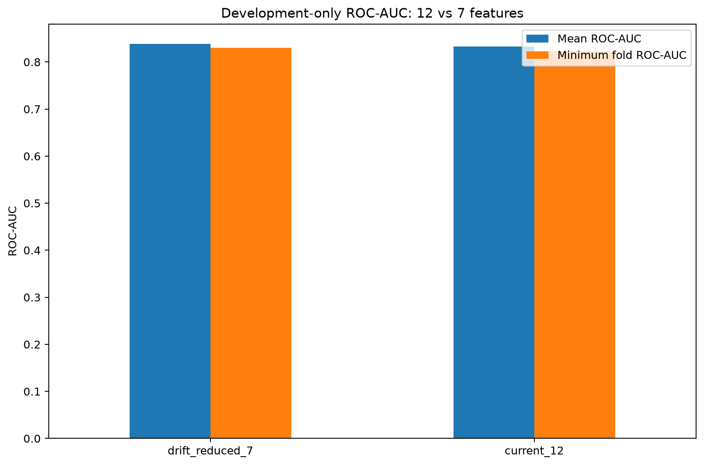

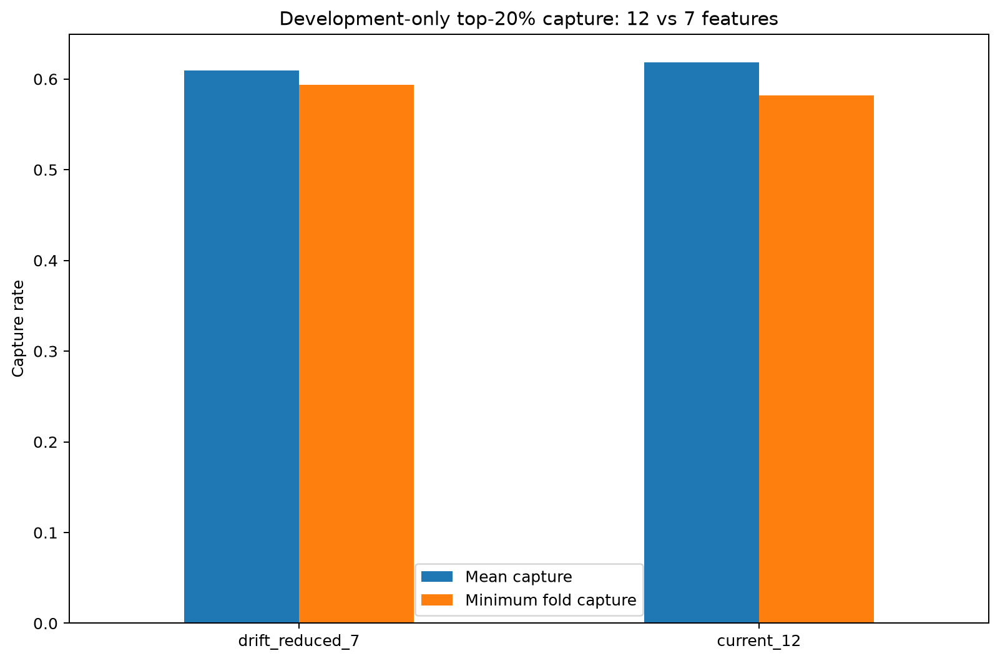

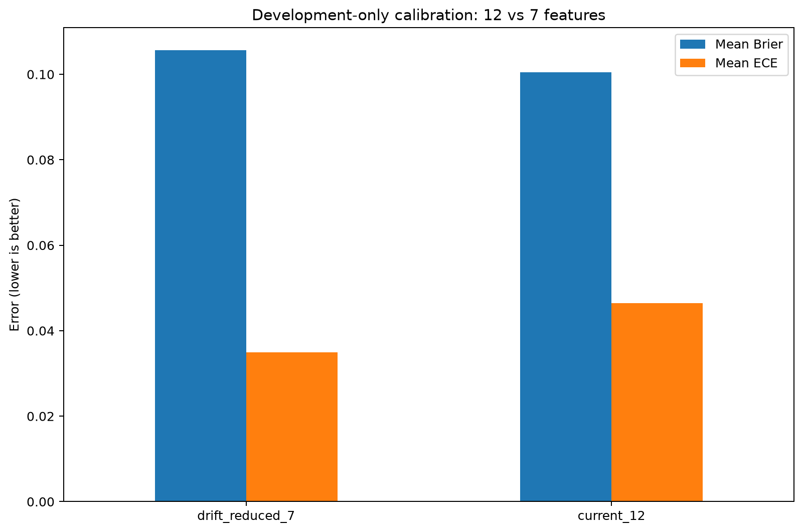

The important point is that the smaller model is genuinely viable across earlier time windows. At the same time, the loss in average precision is real enough that simplification is not free. We therefore kept the seven-feature version as a serious lower-temporal-dependence challenger rather than replacing the formal model.

**Outputs:**
- `reports/tables/module4_dev_12_vs_7_fold_metrics.csv`
- `reports/tables/module4_dev_12_vs_7_summary.csv`
- `reports/tables/module4_dev_12_vs_7_summary.json`
- `reports/figures/module4/development_12_vs_7_roc_auc.png`
- `reports/figures/module4/development_12_vs_7_capture.png`
- `reports/figures/module4/development_12_vs_7_calibration.png`

---

## 15. Incremental add-back of the five excluded predictors

**Script:** `src/models/incremental_addback_analysis.py`

**Status:** **Completed**

The 7-vs-12 comparison raised a more useful question than simply asking which model was better: what were the five extra predictors actually buying us?

The answer is uneven.

| Variant | Mean ROC-AUC | Mean average precision | Mean Brier | Mean ECE | Mean top-20% capture |
|---|---:|---:|---:|---:|---:|
| Base 7 | 0.8384 | 0.4994 | 0.1056 | 0.0350 | 60.96% |
| + `daily_decr30` | 0.8398 | **0.5780** | 0.1007 | 0.0489 | **62.28%** |
| + `daily_decr90` | 0.8396 | 0.5772 | 0.1008 | 0.0491 | 62.25% |
| + `rental30` | 0.8437 | 0.5388 | 0.1032 | 0.0343 | 61.45% |
| + tenure/recency pair | **0.8462** | 0.5153 | 0.1047 | 0.0333 | 61.28% |
| + activity trio | 0.8271 | 0.5677 | 0.1008 | 0.0457 | 61.59% |
| Full 12 | 0.8340 | 0.5757 | **0.1006** | 0.0476 | 62.09% |

Most of the average-precision lift comes from either `daily_decr30` or `daily_decr90`. Adding just `daily_decr30` raises mean AP from about **0.499 to 0.578**, essentially matching the full model. The effect is strongest in late June and weakens later, which makes the decrement signal look genuinely useful but also time-dependent.

The tenure/recency pair behaves differently. It gives the best mean ROC-AUC of all tested variants, but only a modest AP improvement. That suggests those fields help refine ranking more than they help concentrate positive cases.

`rental30` adds a smaller and more mixed benefit. The three activity variables together do not outperform the better single add-backs, which points to overlap and interaction rather than simple additive value.

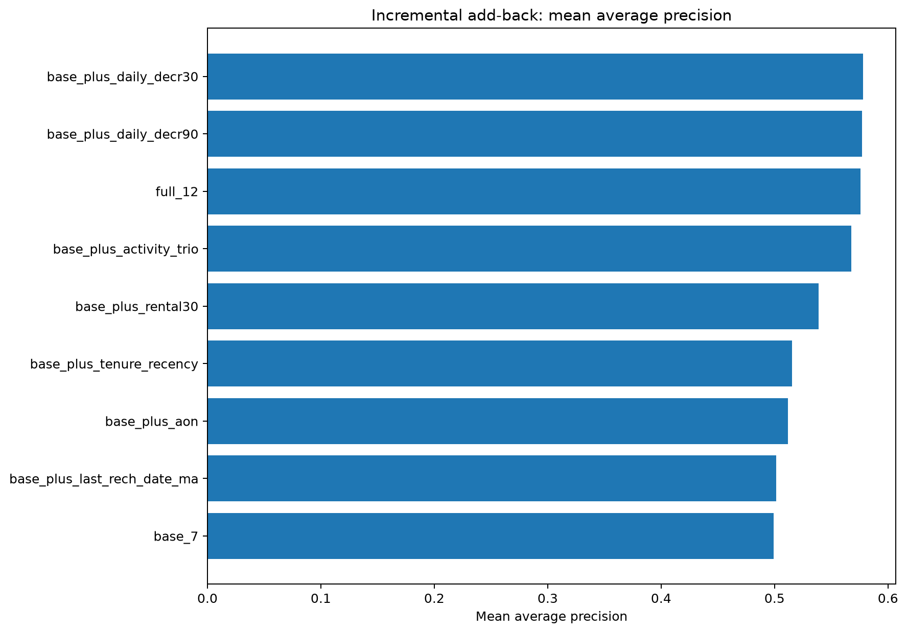

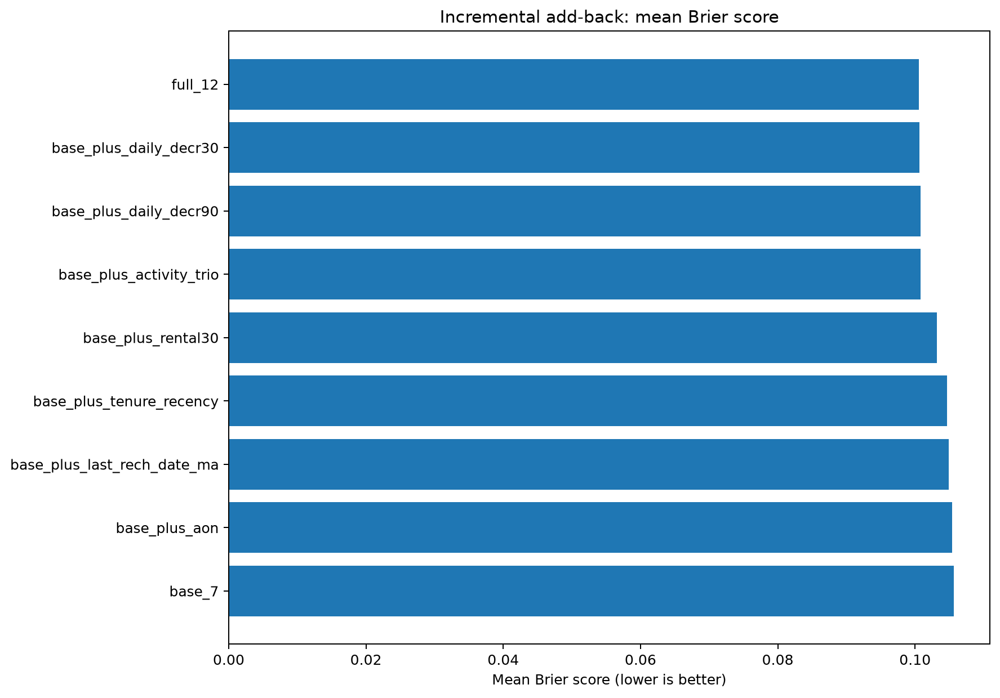

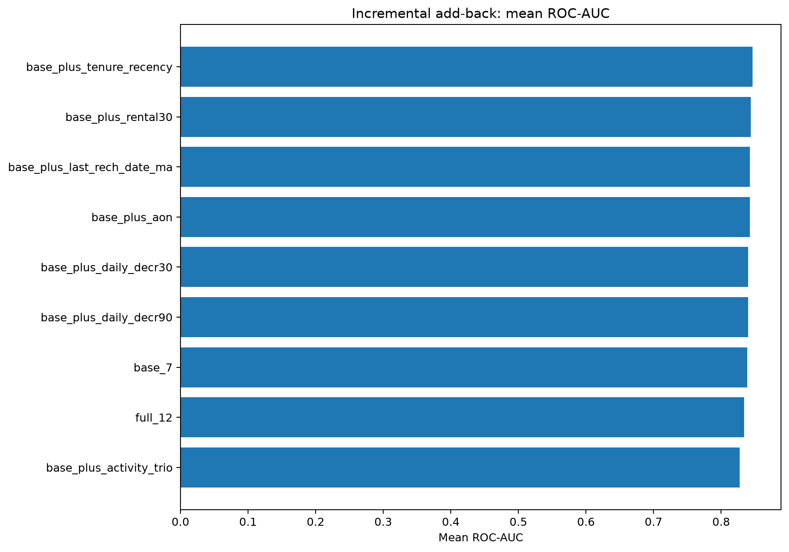

By this point, the larger feature set no longer looked like one coherent block of extra information. It looked more like several different contributions: decrement variables carrying most of the precision lift, tenure/recency helping ranking, and `rental30` adding a smaller signal of its own.

That clarified why the 12-feature model can occasionally look stronger while also being more temporally fragile.

**Outputs:**
- `reports/tables/module4_incremental_addback_fold_metrics.csv`
- `reports/tables/module4_incremental_addback_summary.csv`
- `reports/tables/module4_incremental_addback_summary.json`
- `reports/figures/module4/incremental_addback_average_precision.png`
- `reports/figures/module4/incremental_addback_brier.png`
- `reports/figures/module4/incremental_addback_roc_auc.png`

---

## 16. Are `daily_decr30` and `daily_decr90` redundant?

**Script:** `src/models/check_decr30_decr90_redundancy.py`

**Status:** **Completed**

The two decrement variables turned out to be largely interchangeable in this model.

| Variant | Mean ROC-AUC | Mean average precision | Mean Brier | Mean ECE | Mean top-20% capture |
|---|---:|---:|---:|---:|---:|
| Base 7 | 0.8384 | 0.4994 | 0.1056 | 0.0350 | 60.93% |
| + `daily_decr30` | **0.8398** | **0.5779** | 0.1007 | 0.0489 | **62.28%** |
| + `daily_decr90` | 0.8396 | 0.5772 | 0.1008 | 0.0491 | 62.28% |
| + both decrement variables | 0.8149 | 0.5584 | **0.0997** | **0.0308** | 59.68% |
| Full 12 reference | 0.8332 | 0.5738 | 0.1005 | 0.0464 | 61.83% |

Each single-variable version gives almost the same gain. Once both are included, ranking and capture actually deteriorate. Relative to the better single-feature version, the combined version loses about **0.025 ROC-AUC**, **0.019 average precision**, and **2.6 percentage points of top-20% capture**.

The fold-level results point in the same direction. In late June the single-feature versions reach about **0.840 ROC-AUC**, **0.660 AP**, and **65.3% capture**; the model with both drops to **0.788 ROC-AUC** and **58.7% capture**.

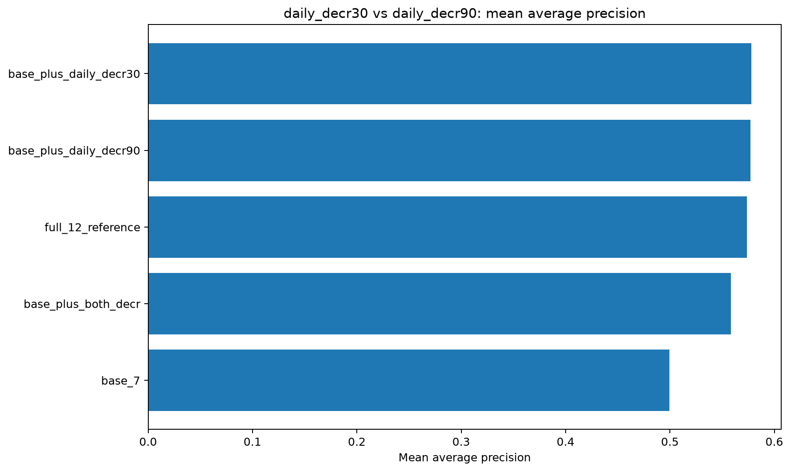

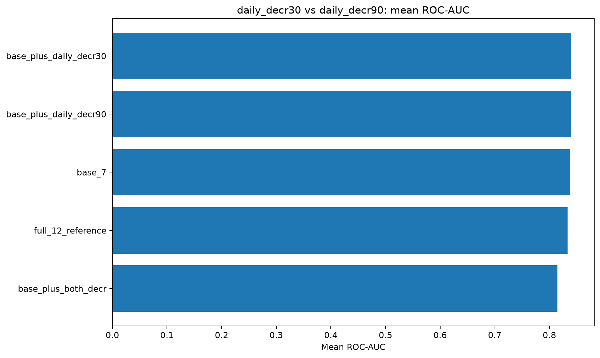

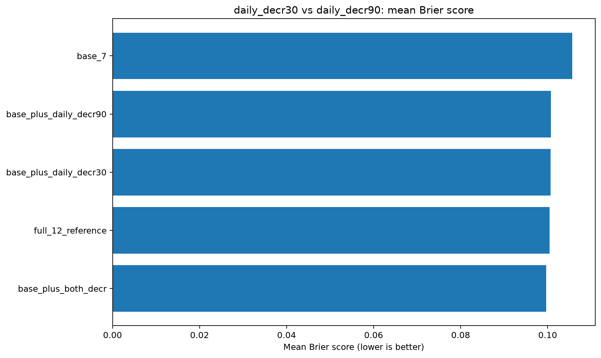

The most plausible reading is redundancy. The two variables describe overlapping windows of similar spending behaviour, and the second one does not appear to add independent ranking signal once the first is present.

If only one is kept, `daily_decr30` has a marginal edge and is easier to explain as recent behaviour. That led naturally to an eight-feature challenger: the seven recharge variables plus `daily_decr30`.

**Outputs:**
- `reports/tables/module4_decr30_decr90_redundancy_fold_metrics.csv`
- `reports/tables/module4_decr30_decr90_redundancy_summary.csv`
- `reports/tables/module4_decr30_decr90_redundancy_summary.json`
- `reports/figures/module4/decr30_decr90_average_precision.png`
- `reports/figures/module4/decr30_decr90_roc_auc.png`
- `reports/figures/module4/decr30_decr90_brier.png`

---

## 17. Direct comparison of the 8-feature challenger and the 12-feature model

**Script:** `src/models/compare_model_8_vs_12.py`

**Status:** **Completed**

The eight-feature challenger is strong enough that the final comparison becomes a trade-off rather than a simple confirmation of the larger model.

Across development folds, the smaller model has a slight edge on ranking and prioritisation:

| Variant | Mean ROC-AUC | Weakest-fold ROC-AUC | Mean average precision | Mean Brier | Mean ECE | Mean top-20% capture |
|---|---:|---:|---:|---:|---:|---:|
| 8-feature challenger | **0.8398** | **0.8312** | **0.5778** | 0.1007 | 0.0489 | **62.28%** |
| Current 12-feature model | 0.8332 | 0.8226 | 0.5737 | **0.1005** | **0.0464** | 61.83% |

The differences are not large. The eight-feature model is better on mean ROC-AUC, AP, and capture; the 12-feature version is slightly better on Brier score and ECE.

On the already-opened holdout, the direction reverses:

| Variant | ROC-AUC | Average precision | Brier | ECE | Top-20% capture |
|---|---:|---:|---:|---:|---:|
| 8-feature challenger | 0.8211 | 0.5555 | 0.1249 | 0.0314 | 53.57% |
| Current 12-feature model | **0.8287** | **0.5667** | **0.1230** | **0.0293** | **54.04%** |

That later-period edge is modest, but every reported metric points the same way.

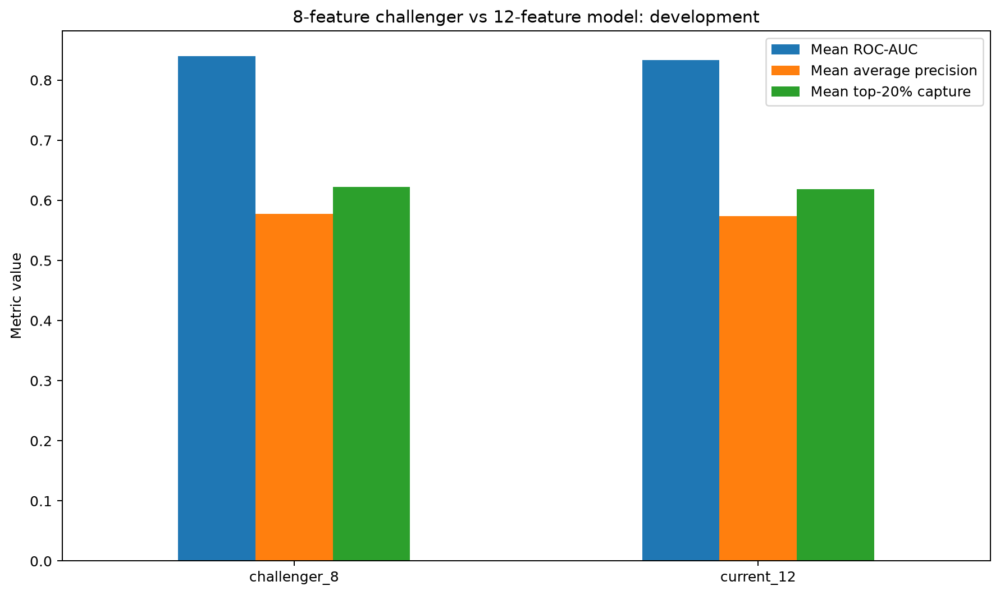

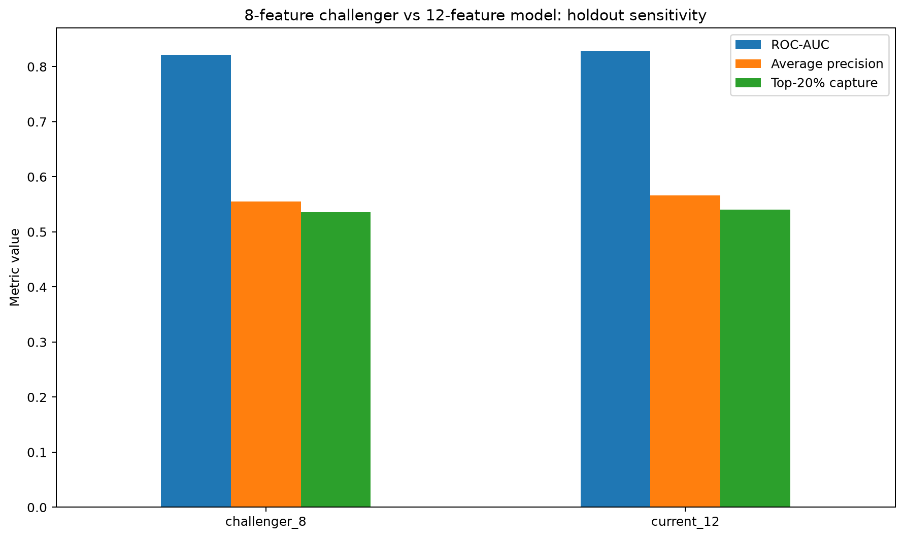

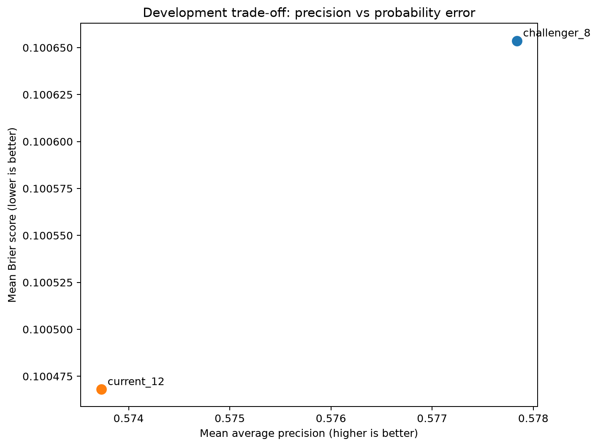

The eight-feature model is therefore more than a stripped-down fallback. It shows that most of the useful signal can be captured with a smaller, cleaner feature set. The 12-feature version, however, appears to retain a small amount of extra resilience in the later holdout.

For the assignment, that is enough reason to keep the 12-feature model as the formal selection while documenting the eight-feature version as a credible challenger. A fresh future validation window would be the right place to revisit that decision.

**Outputs:**
- `reports/tables/module4_8_vs_12_dev_fold_metrics.csv`
- `reports/tables/module4_8_vs_12_dev_summary.csv`
- `reports/tables/module4_8_vs_12_holdout_sensitivity.csv`
- `reports/tables/module4_8_vs_12_summary.json`
- `reports/figures/module4/model_8_vs_12_development.png`
- `reports/figures/module4/model_8_vs_12_holdout.png`
- `reports/figures/module4/model_8_vs_12_tradeoff.png`

---

## 18. Packaging and testing the selected model

**Scripts:** `src/models/package_selected_model.py`, `src/inference/predict_selected_model.py`

**Status:** **Completed**

Once the modelling decisions were settled, the selected model was recreated as a single local artefact containing the fitted median imputer, Random Forest, isotonic calibrator, feature order, and model metadata.

The package was fitted on **101,241 training rows** and calibrated on **20,878 rows** from 7-13 July. The final holdout remained outside fitting.

The local binary is:

`models/selected_random_forest_isotonic.joblib`

The repository-safe metadata file is:

`models/selected_model_metadata.json`

Its SHA-256 fingerprint is:

`b70912867f0838f1e020a973ba5aa3f69e601a1dfce681dbe7d8b84e934dab9e`

That fingerprint gives us a simple integrity check between the metadata and the exact local binary.

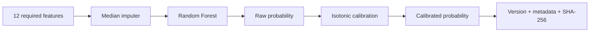
```mermaid
flowchart LR
    A[12 required features] --> B[Median imputer]
    B --> C[Random Forest]
    C --> D[Raw probability]
    D --> E[Isotonic calibration]
    E --> F[Calibrated probability]
    F --> G[Version + metadata + SHA-256]
```

The inference-contract tests pass:

```text
collected 2 items
tests/unit/test_inference_contract.py .. [100%]
```

A real batch run then scored **10 rows from the actual model-ready dataset** without error. The mean calibrated delinquency probability was **0.117993**.

That run is evidence that the persisted package can be loaded and used against real project-shaped data. It is not a new performance evaluation.

The inference layer returns probabilities only. It does not implement an approval or decline decision. The temporary row-level input and prediction files used for the test remain local and are not repository evidence.

**Local artefact:**
- `models/selected_random_forest_isotonic.joblib`

**Repository-safe metadata:**
- `models/selected_model_metadata.json`

**Supporting files:**
- `models/README.md`
- `tests/unit/test_inference_contract.py`
- `pytest.ini`


---

## 19. FastAPI prediction endpoint

**File:** `src/api/app.py`

**Status:** **Completed**

The packaged model is now exposed through a small FastAPI service so the project has an explicit `/predict` endpoint rather than only a command-line batch scorer.

The service accepts the same 12-feature contract used by the packaged model and returns the raw Random Forest probability, the isotonic-calibrated five-day delinquency probability, model name, and artefact version. It does not convert the score into an approval or decline decision.

A separate `/health` route is included for a basic availability check.

Unit tests cover successful prediction, missing-feature rejection, and the health endpoint. All three tests pass locally. The two warnings emitted by the test stack are deprecation warnings from dependencies and do not affect endpoint behaviour. The binary model remains local; the API loads the packaged artefact from `models/selected_random_forest_isotonic.joblib`.

```text
collected 3 items
tests/unit/test_api.py ... [100%]
```

The assignment report will link directly to the GitHub implementation where the word limit does not justify reproducing technical detail in the narrative.


---

## 20. Conventional classification artefacts

**Script:** `src/models/generate_module4_classification_artifacts.py`

**Status:** **Completed**

The assignment asks for conventional classification metrics in addition to the ranking and calibration measures that are more natural for this project. We therefore froze an operating threshold using development-only chronological predictions and then applied that threshold unchanged to the final holdout.

The development selection rule matched the original project criterion: seek at least **50% recall** and **45% precision**, then choose the qualifying threshold with the highest F1. A feasible threshold was found at **0.175141**.

On the final holdout, the selected calibrated Random Forest produced:

| Metric | Result |
|---|---:|
| Accuracy | 0.7359 |
| Precision | 0.4258 |
| Recall | 0.7769 |
| F1 | 0.5501 |
| ROC-AUC | 0.8287 |
| Average precision | 0.5667 |
| Predicted positive rate | 37.92% |
| Observed delinquency rate | 20.78% |

The corresponding confusion matrix is:

|  | Predicted on-time | Predicted delinquent |
|---|---:|---:|
| Observed on-time | 16,457 | 6,238 |
| Observed delinquent | 1,328 | 4,625 |

The threshold was not chosen on the holdout. That distinction matters because the holdout precision falls below the original **45%** target even though recall remains comfortably above **50%**. This is another sign that performance shifts over time and should not be presented as a stable production operating point.

The majority-class baseline achieves **79.22% accuracy**, which is higher than the model's 73.59%. That does not make the baseline useful: it predicts no delinquent cases at all, giving precision, recall, and F1 of zero. The comparison is a good illustration of why accuracy is a poor headline metric for this imbalanced problem.

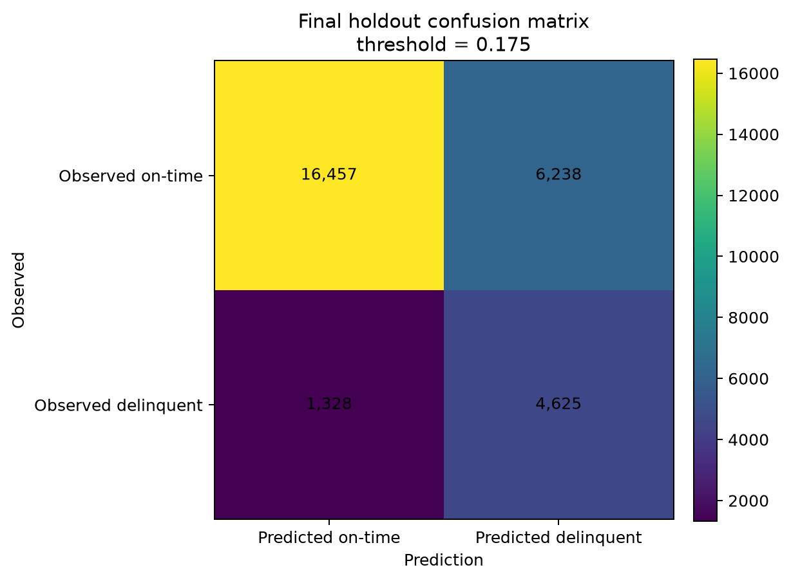

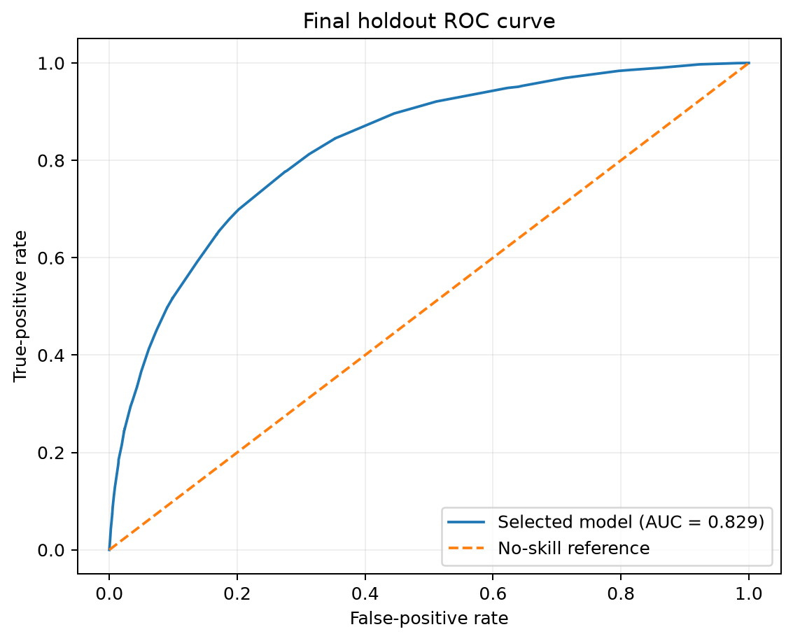

These conventional metrics supplement rather than replace the project's main evidence. ROC-AUC, average precision, calibration quality, and top-risk capture remain more informative for a prioritisation model that is not intended to make autonomous approve/decline decisions.

**Outputs:**
- `reports/tables/module4_classification_metrics.csv`
- `reports/tables/module4_classification_threshold.json`
- `reports/figures/module4/final_holdout_confusion_matrix.png`
- `reports/figures/module4/final_holdout_roc_curve.png`


---

## 21. Formal fairness assessment

**Report:** `reports/module4_fairness_report.md`

**Status:** **Completed**

The earlier robustness work has now been packaged into a standalone fairness artefact so the assignment requirement is explicit rather than left implicit across several technical files.

The report does not manufacture a demographic result. It records that the model-ready dataset has no usable protected-group attributes, so demographic parity, Equalized Odds, Equal Opportunity, and protected-group error-rate gaps cannot be calculated responsibly.

Instead, the report separates three things that could otherwise be confused:

- representation diagnostics, including the imbalance between first-time and returning borrowers;
- operational robustness across tenure and recharge-frequency segments;
- residual fairness risks, especially unmeasured proxy effects and the risk of unfair operational use.

No demographic bias-mitigation algorithm was applied because there is no defensible protected-group attribute or measurable disparity objective on which to base one.

**Supporting files:**
- `reports/module4_fairness_report.md`
- `reports/tables/module4_fairness_metrics_status.json`
- `reports/tables/module4_operational_robustness_segments.csv`
- `reports/tables/module4_feature_sensitivity.csv`
- `docs/governance/representation_bias_assessment.md`


---

## 22. Counterfactual-style local explanations

**Script:** `src/models/generate_module4_counterfactuals.py`

**Status:** **Completed**

The counterfactual exercise was kept deliberately more rigorous than the minimum assignment requirement. Rather than manually changing a feature until a different label appeared, the script searches for small threshold-crossing changes using values observed in the training population.

The operating threshold remained the previously frozen development-selected value of **0.175141**. It was not selected or adjusted using the final holdout.

Three holdout cases were examined.

| Case | Original score | Counterfactual score | Change found |
|---|---:|---:|---|
| Closest case below threshold | 0.166667 | 0.184862 | `sumamnt_ma_rech30`: 3079 → 3078 |
| Closest case above threshold | 0.176140 | 0.143245 | `aon`: 516 → 526 |
| Representative high-risk case | 0.470588 | — | No threshold-crossing result within constrained search |

The first result is striking because a one-unit movement in 30-day recharge amount is enough to cross the operating threshold. This should not be read as an economically meaningful behavioural recommendation. It is evidence of the piecewise nature of a tree model: an observation can sit very close to a learned split, so a numerically tiny change can move it onto a different path through the forest and then through the isotonic mapping.

The second case is easier to interpret numerically. Increasing the observed account-tenure measure from 516 to 526 moved the calibrated score from just above the threshold to clearly below it. Again, this is a description of fitted model behaviour rather than a causal claim.

The high-risk case did not cross the threshold under the constrained search. That is useful evidence in its own right. It shows that the search is not guaranteed to manufacture a counterfactual for every case, and that strongly elevated predictions may require changes outside the deliberately narrow search space.

```text
near_boundary_predicted_on_time:
  0.166667 -> 0.184862
  sumamnt_ma_rech30: 3079 -> 3078

near_boundary_predicted_delinquent:
  0.176140 -> 0.143245
  aon: 516 -> 526

representative_high_risk:
  0.470588
  no constrained threshold-crossing counterfactual found
```

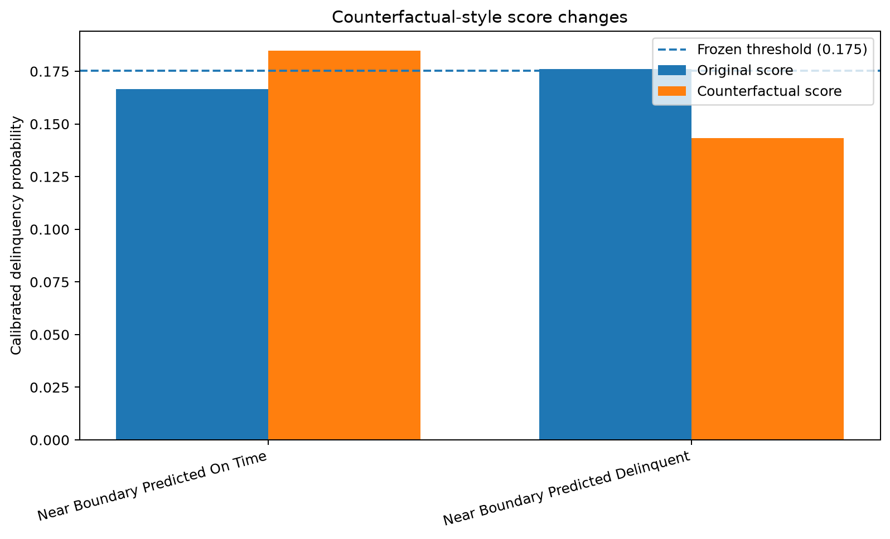

The exercise is explicitly contrastive. It answers, “what small observed-range change would alter the fitted model's classification?” It does **not** answer, “what should a customer do?” or “what would cause repayment behaviour to change?”

**Outputs:**
- `reports/tables/module4_counterfactual_explanations.csv`
- `reports/tables/module4_counterfactual_summary.json`
- `reports/figures/module4/counterfactual_risk_changes.png`


---

## 23. MLflow experiment evidence

**Script:** `src/models/export_module4_mlflow_evidence.py`

**Status:** **Completed**

The Module 4 modelling work was tracked locally in MLflow using a SQLite backend. The tracking database itself stays outside GitHub, while a repository-safe export now preserves the experiment structure, run identifiers, parameters and metrics needed to demonstrate traceability.

Five core experiments were found in the local tracking database:

| Experiment | Tracked runs |
|---|---:|
| `module4_candidate_model_benchmark` | 9 |
| `module4_model_tuning` | 24 |
| `module4_final_holdout_evaluation` | 6 |
| `module4_development_calibration` | 18 |
| `module4_calibrated_holdout_sensitivity` | 4 |
| **Total** | **61** |

The run counts align with the modelling workflow: candidate benchmarking, hyperparameter tuning, final holdout evaluation, development-only calibration assessment, and the later calibrated-holdout sensitivity check.

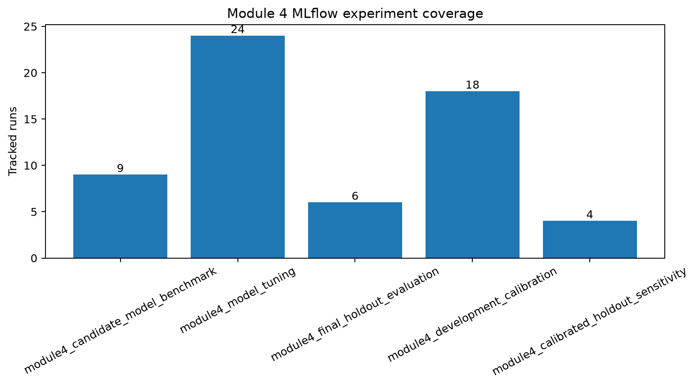

The SQLite database is intentionally not committed. The exported CSV and JSON provide the public audit trail without exposing or versioning the database file itself.

The assignment screenshot is now captured from the `module4_model_tuning` experiment in MLflow's Model training view. It shows the 24 tracked tuning runs together with average precision, Brier score, ROC-AUC, top-20% capture and selected hyperparameters (`max_depth`, `min_samples_leaf`). The final-holdout experiment remains available as linked GitHub evidence, but a second screenshot is not necessary.

**Outputs:**
- `reports/module4_mlflow_evidence.md`
- `reports/tables/module4_mlflow_runs.csv`
- `reports/tables/module4_mlflow_experiments.json`
- `reports/figures/module4/mlflow_experiment_run_counts.png`
- `reports/figures/module4/mlflow_model_tuning_runs.png`
